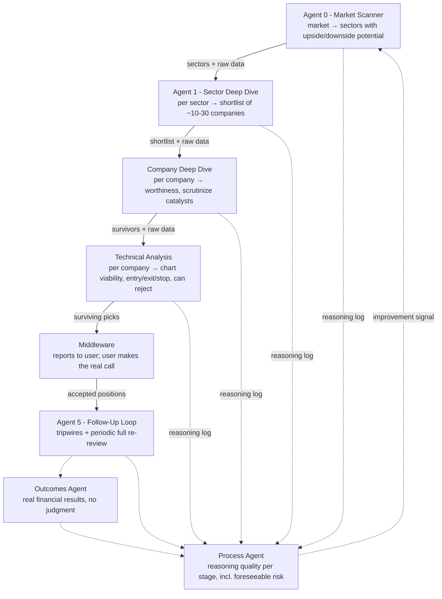

# Multi-Agent Trading Pipeline: Architecture

This is the design the pipeline implements: its principles, rules and decisions. Read
it before changing any agent, prompt or command. **How** it is implemented (Claude
Code subagents, prompts, hooks, the workspace) is in
[`prompt-subagents-design.md`](prompt-subagents-design.md). The original design summary
is kept in [`architecture-summary.html`](architecture-summary.html).

All market data comes from **Equibles** (see §6). It is a
**research and decision-support system**. It never places orders. A human makes
every go/no-go call.

## 1. Overview

The pipeline is a chain of independent agents. Each one handles one stage of
trade research and feeds the next stage. Agents within a stage run in parallel,
one per candidate and independently, to avoid correlated bias. Every agent
outputs structured reasoning with its verdict, not just pass/fail, so the
retrospective feedback loop can trace where judgment broke down.

Step-by-step runtime flow (sequence diagrams): [`sequence-diagrams.md`](sequence-diagrams.md).

## 2. Stage responsibilities

| Stage | Agent (prompts in `prompts/<agent>/`) | Runs | Input | Output |
|---|---|---|---|---|
| Agent 0: Market Scanner | `market-scanner` | once per run | sector ETF performance + macro data | sectors with upside/downside potential |
| Agent 1: Sector Deep Dive | `sector-deep-dive` | one per sector, in parallel | sector call + **bulk screen of the sector's companies** (ratios, size, prices, recent filings/events) + breadth, FDA, earnings | shortlist **ranked by potential score** |
| Company Deep Dive | `company-deep-dive` | one per company, in parallel | shortlist entry + market/sector/macro data + **full company data** (fundamentals, filings, guidance, estimates, transcripts, insider and short data) | worthiness verdict; catalysts checked |
| Technical Analysis | `technical-analysis` | one per company, in parallel, **no cross-comparison** | candidate + **investor profile** + price statistics, swing levels and weekly bars for the horizon's charts + earnings date | chart verdict + entry / stop / target / horizon / chart timeframe, or rejection; then the **profile's rules** |
| Middleware | the commands in `.claude/commands/` | orchestrates | | report to the user; records the user's decisions |
| Agent 5: Follow-Up | `follow-up` | on a schedule, per accepted position | position + profile + fresh data + every earlier analysis | tripwire checks (price vs stop/target, **material** news only) with a **12h alert cooldown**, plus a full re-review on alert or every 14 days |
| Evaluation | `stage-evaluator` | per agent and past run | the agent's analyses + prices since | **outcome facts** (no judgment), then **reasoning-quality grades** with an attribution per miss |
| Feedback | `stage-feedback` | per agent, on request | the agent's evaluations | proposed lessons; added to prompts only after the user approves |

## 3. Design principles (non-negotiable)

1. **Sequential between stages, parallel and independent within a stage.** Each
   candidate gets its own unbiased pass. The technical stage never compares
   candidates with each other.
2. **Raw-data pass-through.** Each agent receives the prior agent's report
   **and** the raw data behind it, so a bad upstream filter can't fully blind
   the next stage. Every Equibles response an agent receives is saved to its analysis
   folder's `raw/`, and the next agent reads the upstream analysis and its `raw/`.
   **Scope:** a company's agents read market-level data plus everything about that
   company and its sector, but not other companies' files. Nothing about the company
   itself is ever dropped.
3. **Two independent filters.** Fundamental worthiness and technical
   tradeability are uncorrelated. Rejecting a fundamentally strong company on
   chart grounds is a normal outcome, not an error.
4. **Structured reasoning, not just verdicts.** Every agent logs what pushed it
   toward or away from its conclusion (factors with evidence, risks weighed, data gaps,
   confidence; `prompts/shared.md`). This log is the
   backbone of the feedback loop.
5. **The middleware reports in one direction only.** It reports pipeline output
   to the user. The user's manual accept/reject **never** feeds back into the
   system as if it were the system's own judgment. User decisions are stored
   apart from stage records, and the process agent cannot read them. The
   decision only controls whether a position enters the follow-up watch list.
6. **Split meta-review.** The outcomes agent (pure P&L, no judgment) and the
   process agent (reasoning quality) are decoupled. A well-reasoned trade that
   loses to a genuine black swan must not be penalized like a missed,
   foreseeable risk such as macro exposure.
7. **Swing or long-term horizons only, never day trading.** Cross-stage data
   staleness is therefore not a concern.

## 4. Investor profile, horizons and rules

**Investor profile** (`workspace/profile.json`, example in `profile.example.json`): who the pipeline works for, including risk tolerance, allowed
holding horizons, whether shorts are allowed, maximum loss per trade, minimum
reward:risk, target return, how stop/target hits are detected (`level_trigger`), and
free-text notes. It is the user's *preferences*, set up
front, not a decision, so showing it to agents does not break the one-way middleware
principle. The technical agent and Agent 5's full review read it, and the rules
enforce it.

**Horizons and chart timeframes.** Each horizon has its own charts; the technical
agent reads levels from the primary chart and trend from the context chart, and
fetches every timeframe the profile's horizons need.

| Horizon | Typical hold | Primary chart | Context chart | Earnings flag window |
|---|---|---|---|---|
| `swing` | weeks to ~3 months | 1d, 1 year | 1w, 2 years | 45 days |
| `long_term` | months to years | 1w, 5 years | 1d, 1 year | 30 days |

Day trading is **not** supported: it conflicts with principle 7 (intraday data goes
stale while the pipeline runs). Adding it would need a decision to change that principle.

**Rules** (`prompts/technical-analysis/role.md`). Rules never make judgment calls: they
catch mechanical errors, enforce the profile and flag known risks. The technical agent
applies every rule to its own plan and records each result with its numbers, and the
middleware recomputes price order, max loss and reward:risk before recommending (a
mismatch blocks the recommendation). The evaluator can therefore tell a rule veto from
a judgment failure. `reject` removes the candidate; `flag` warns the user in the report.

| Rule | Outcome | When |
|---|---|---|
| `plan_price_order` | reject | long needs stop < entry < target; short the reverse |
| `profile_horizon` | reject | plan horizon not in the profile's horizons |
| `chart_timeframe` | flag | plan levels not read from the horizon's primary chart |
| `profile_short` | reject | short plan when shorts are not allowed; downside sector calls are then not pursued |
| `max_loss` | reject | stop further from entry than `max_loss_per_trade_pct` |
| `reward_to_risk` | reject | reward:risk below `min_reward_to_risk` |
| `stale_entry` | reject | price already more than `stale_entry_max_drift_pct` (3%) past the entry, or through the stop. Live runs use the live quote; backtests use the last close at `as_of`. A price that hasn't reached the entry yet is fine. |
| `upcoming_earnings` | flag | earnings inside the horizon's window, or the date is unknown |

**Conflicts:** when the same ticker comes from
more than one sector call, it is **always recorded**, as `direction_conflict` (opposite
directions) or `duplicate`. The first surfacing advances; the record is stored and shown
in the report.

**Stop and target hits** follow the profile's `level_trigger`: `close` (default) counts
a hit only when a bar *closes* beyond the level; `intraday` counts it as soon as the bar's
low/high touches it. The follow-up agent and the evaluator use the same definition.

**Alerts** (Agent 5). A tripwire fires on price hitting the stop or target (per
`level_trigger`), or on **material** news. The follow-up agent keeps SEC 8-Ks with material
items (e.g. 1.01, 2.02, 5.02), earnings, guidance, FDA, M&A, rating changes, offerings,
legal and leadership news, and drops price-action chatter, reiterations and listicles.
Each alert triggers a full re-review. After an alert, further alerts for the same
position are **held for 12 hours**. Anything that trips meanwhile is
recorded and delivered with the next alert, so nothing material is lost.

## 5. Design decisions

**Decided (2026-09-25):**

| Decision | Choice | Why |
|---|---|---|
| Agent 1 output format | **Ranked by potential score (0-100)**; passing companies are forwarded best-first, capped per sector. Pass/fail is still recorded. | Gives the feedback loop a gradient ("scored 85 and failed" teaches more than "passed and failed") and lets later stages triage. |
| Running confidence score | **Attribution only.** Recorded at every stage as a trajectory; gates nothing; hidden from downstream agents. | Traces where doubt entered without anchoring later agents or trusting uncalibrated scores. Revisit gating once testing shows calibration. |
| Agent 1 data | **Bulk screen at Agent 1, deep data later.** Agent 1 screens every company in the sector from cheap bulk data; full per-company fundamentals are fetched only for the shortlist. | Full fundamentals for a whole sector cost ~28 Equibles calls per company. |
| Raw-data pass-through scope | **Relevant subset**: market + sector + the company's own data. | Keeps the principle (no stage blinded by an upstream filter) at a fraction of the token cost of repeating every company's data in ~30 prompts. |

**Decided (2026-09-25, second round):**

| Decision | Choice |
|---|---|
| Data vendor | **Equibles for all data.** Anything Equibles doesn't provide is deferred, not sourced elsewhere. |
| Stop/target definition | **Customizable in the investor profile** (`level_trigger`: `close` or `intraday`), shared by alerts and outcomes. |
| Duplicate decisions | **Blocked.** A second accept/reject for the same candidate is refused. |
| Cost | Not a concern for now; no budgets or caching work yet. |

**Decided (2026-09-25/26, the subagent build):**

| Decision | Choice |
|---|---|
| Architecture | **Prompt-based Claude Code subagents** that fetch their own data; the Python pipeline was removed on 2026-09-26. Details, and decisions D0-D5, in [`prompt-subagents-design.md`](prompt-subagents-design.md). |
| Your trade in evaluation (D0) | Evaluation grades agents against the market; the comparison with your decisions goes to `decisions/reviews/` and is shown to you only, never to an agent. |
| Backtests (D1) | A gatekeeper agent builds point-in-time data packs, an auditor checks them, and backtest agents have no data tools. |
| Rules and outcomes (D3) | In prompts; the middleware recomputes the plan arithmetic. |
| Forward testing | Every live run is graded by the evaluators as outcomes arrive, including candidates nobody traded: the "shadow ledger" of [`testing-research.md`](testing-research.md), Phase 0. |
| Models (D5, revisited) | Per agent, in `.claude/agents/` (design doc §11). |

**Open:**

- **Plan margins.** Recommendations have repeatedly sat right at the profile's limits
  (e.g. max loss 7.8% vs 8%, reward:risk 2.03 vs 2.0). Whether plans should keep a
  margin from the limits is the user's call.
- **Broker paper trading** would relax the no-orders rule and needs an explicit decision.

**Future enhancements (not planned now):**

- **Day trading** as a horizon (would need principle 7 changed).
- **More rules:** liquidity floor, sector concentration across recommendations.
- **Own snapshots of scheduled-event calendars** (earnings, FDA). Not needed if Equibles
  keeps the dates *as they were expected at the time*; worth revisiting if backtests
  show it doesn't.
- **Cost controls:** token/cost tracking and per-run budgets.
- **Real-model evaluation:** test prompt quality against the real model with an
  evaluation set, once the system is complete.

## 6. Data requirements

Every category needs a **live** version (to run the system) and a **deep
historical, point-in-time** version (to backtest it honestly):

- Price and volume
- Sector-level performance and breadth
- News and catalyst events (earnings, FDA, analyst actions)
- Company fundamentals (financials, filings, ownership, valuation)
- Macro data (rates, inflation, FX), for the foreseeable-risk checks

**Vendor: Equibles** (hosted MCP at `https://mcp.equibles.com/mcp`, configured in
`.mcp.json`). Anything it doesn't provide is **deferred**. Each agent may call only the
read-only tools listed in its definition (`.claude/agents/`); the account tools
(portfolios, lots, watches, reports) are denied for everyone.

| Need | Equibles tools | Used by | Notes |
|---|---|---|---|
| Daily prices, indicators, support/resistance | `GetStockPrices` (daily only, ≤500 rows per call), `GetAverageTrueRange`, `GetBollingerBands`, `GetStochasticOscillator`, `GetOnBalanceVolume` | scanner, sector, technical, follow-up, evaluator | For the scanner, sector and technical agents a hook replaces each price response with computed statistics (returns, 20/50/200-day averages, 52-week range, ATR14, dollar volume; swing levels and weekly bars for the technical agent). A bar counts from 16:00 New York on its date. **Backtest caveat:** Equibles restates history after each split and exposes no split events, so past absolute levels reflect later splits (percent moves are unaffected). |
| Quotes | `GetLiveQuote`, `GetLatestClosingPrices` | technical, follow-up | Live quote on Plus (15-min delayed) or Pro; last close otherwise. Never in backtests. |
| Sector performance | `GetStockPrices` on SPY + the 11 sector ETFs | scanner | |
| Sector constituents, screen and breadth | `GetEtfHoldings`, `ScreenStocks` (up to 200 tickers per call), `GetValuationMultiples`, `GetStockPrices` | sector | Constituents = the sector ETF's top 25 holdings, usable once public (period + 60 days). Only the latest holdings report is served, so older backtests get a gap (or survivorship-biased current holdings). |
| Fundamentals | `GetFinancialFact`, `GetFinancialStatement`, `GetValuationMultiplesHistory` | company | A figure counts from the day after its filing; as-reported values preferred. Per-share values are on today's share basis (dropped in backtests). |
| Filings and documents | `ListFilings`, `SearchDocument`, `ReadDocumentLines` | sector, company, follow-up | 10-K/10-Q/8-K; 8-K item numbers say what happened. |
| Company news and events | `GetInvestorRelationsNews`, `GetUpcomingInvestorEvents`, `GetFdaAdvisoryCommitteeMeetings` | sector, company, follow-up | Press releases from IR sites (partial coverage); announced earnings dates (live only); FDA advisory meetings visible 15 days ahead. |
| Expectations | `GetGuidance`, `GetAnalystEstimates`, `GetEarningsCallTranscript` | company | Estimates are "now only" (never in backtests). |
| Ownership and risk | `GetInsiderTransactions`, `GetShortInterest`, `GetDebtProfile`, `GetGoingConcernStatus` | company | |
| Macro | `GetEconomicIndicator`, `GetLatestEconomicIndicators`, `GetEconomicCalendar`, `GetVixHistory`, `GetPutCallRatios` | scanner (others read its `raw/`) | 13 FRED series; a value counts after its period ends plus the publication lag. Latest-revised values (no vintages). |
| Third-party news, PDUFA dates, macro vintages, FOMC dates | Not provided | | **Deferred** |

Backtests replace direct access with the gatekeeper's data packs; the per-tool
point-in-time rules are in `prompts/gatekeeper/role.md`.

Background research that led here: [`data-sources-research.md`](data-sources-research.md),
[`live-prices-research.md`](live-prices-research.md),
[`equibles-evaluation.md`](equibles-evaluation.md).

**Gaps are explicit.** A tool that fails or returns nothing is recorded as
`UNAVAILABLE`, and data an agent was asked for but didn't fetch as `NOT CHECKED`, so the
evaluator can separate "bad reasoning" from "no data".

## 7. Overall assessment (from the design discussion)

- The architecture is sound. Whether it makes money is **unknown and must not
  be assumed**. The design's value is that it is honest and falsifiable.
- **Overfitting risk:** keep a held-out validation period that the system was
  never tuned against (`PipelineConfig.holdout_start`). Weight the process
  agent's reasoning-quality signal, not only outcomes.
- **The model already knows the past.** Any backtest dated before an LLM's training
  cutoff can leak outcomes that no point-in-time data fixes. Only results from dates
  after the training cutoff of every model used count as honest evidence, so set
  `holdout_start` accordingly.
- Expect early versions to be mediocre or to lose money. That is the system
  surfacing weak reasoning.

## Implementation

Implemented as Claude Code subagents: see
[`prompt-subagents-design.md`](prompt-subagents-design.md) for the layout (prompts,
subagents, commands, hooks, workspace), how each principle above is enforced, the
backtest mode and the per-agent models, and [`operations.md`](operations.md) for
running it.

## Remaining work

**Built and run live:** the four research stages, the middleware and report, the
decisions firewall and raw-data capture (hooks), price statistics, a one-stage backtest.

**Built, not yet exercised end to end:** follow-up (`/follow-up`, `/trade`), evaluation
and feedback (`/evaluate`, `/feedback`, `/approve`), a full four-stage backtest.

**Still open:**
- **Plan margins** (§5).
- **Sector screen stability:** the sector agent's ranking moved between runs at low
  effort (e.g. NVDA scored 88, 88, then 71); consider medium effort.
- **News filter for biotech 8-Ks** filed under items 7.01/8.01 (the follow-up agent reads
  the text, but the rule is untested).

**Future enhancements:** see §5.
