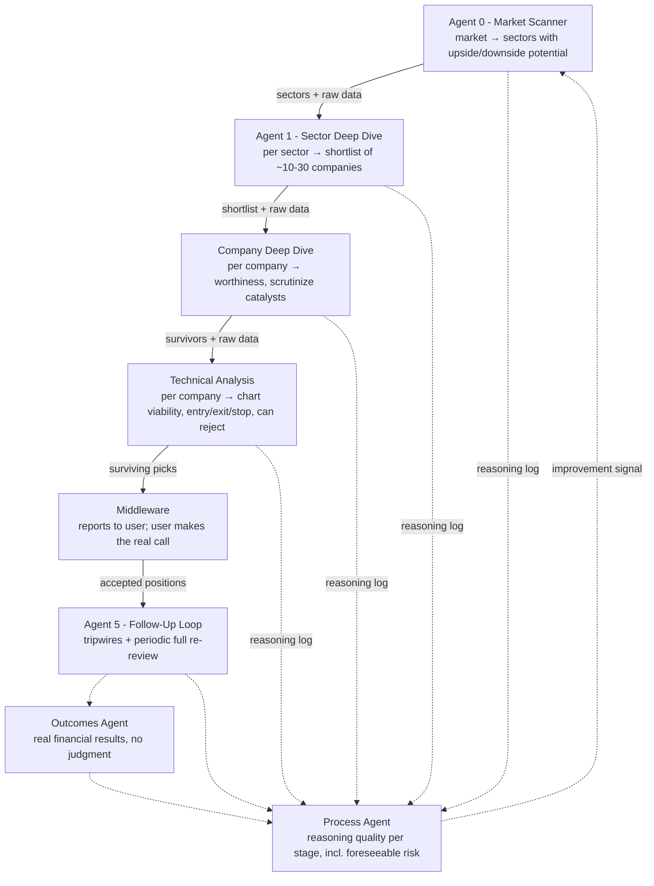

# Multi-Agent Trading Pipeline: Architecture

This is the design this codebase implements. Read it before changing any agent,
schema, or the middleware. The original design summary is kept in
[`architecture-summary.html`](architecture-summary.html). This file restates it
and adds the implementation decisions made during scaffolding (see
[Implementation decisions](#implementation-decisions)).

The design started as an extension of the dual-MCP stock agent (Massive.com + Robinhood),
but **those providers are not locked in** (see §5). It is a
**research and decision-support system**. It never places orders. A human makes
every go/no-go call.

## 1. Overview

The pipeline is a chain of independent agents. Each one handles one stage of
trade research and feeds the next stage. Agents within a stage run in parallel,
one per candidate and independently, to avoid correlated bias. Every agent
outputs structured reasoning with its verdict, not just pass/fail, so the
retrospective feedback loop can trace where judgment broke down.

## 2. Stage responsibilities

| Stage | Module | Runs | Input | Output |
|---|---|---|---|---|
| Agent 0: Market Scanner | `agents/market_scanner.py` | once per run | raw market and sector data | sectors with upside/downside potential |
| Agent 1: Sector Deep Dive | `agents/sector_deep_dive.py` | one per sector, in parallel | sector call + raw data (fundamentals, news, FDA, earnings) | shortlist of ~10-30 companies |
| Company Deep Dive | `agents/company_deep_dive.py` | one per company, in parallel | shortlist entry + raw company data | worthiness verdict; catalysts checked |
| Technical Analysis | `agents/technical_analysis.py` | one per company, in parallel, **no cross-comparison** | candidate + raw price/indicator/pivot data | chart verdict + entry / exit / stop-loss, or rejection |
| Middleware | `middleware.py` | orchestrates | | report to the user |
| Agent 5: Follow-Up | `agents/follow_up.py` | on a schedule, per accepted position | position + fresh data | cheap tripwire checks, plus a deep full re-review at an interval |
| Outcomes Agent | `agents/outcomes.py` | per closed/marked position | price history | financial results only; **deterministic, no LLM, no judgment** |
| Process Agent | `agents/process_review.py` | per position | every stage's reasoning trail + outcome | per-stage reasoning-quality grades, foreseeable-risk check, improvement signals |

## 3. Design principles (non-negotiable)

1. **Sequential between stages, parallel and independent within a stage.** Each
   candidate gets its own unbiased pass. The technical stage never compares
   candidates with each other.
2. **Raw-data pass-through.** Each agent receives the prior agent's report
   **and** the raw data behind it, so a bad upstream filter can't fully blind
   the next stage. In code, every stage input carries the upstream report plus a
   `RawDataBundle`. Stages add to the bundle as it moves forward.
3. **Two independent filters.** Fundamental worthiness and technical
   tradeability are uncorrelated. Rejecting a fundamentally strong company on
   chart grounds is a normal outcome, not an error.
4. **Structured reasoning, not just verdicts.** Every agent logs what pushed it
   toward or away from its conclusion (`StageReasoning`). This log is the
   backbone of the feedback loop.
5. **The middleware reports in one direction only.** It reports pipeline output
   to the user. The user's manual accept/reject **never** feeds back into the
   system as if it were the system's own judgment. User decisions are stored
   apart from stage records, and the process agent cannot read them. The
   decision only controls whether a position enters the follow-up watch list.
6. **Split meta-review.** The outcomes agent (pure P&L, no judgment) and the
   process agent (reasoning quality) are decoupled. A well-reasoned trade that
   loses to a genuine black swan must not be penalized like a missed,
   foreseeable risk such as macro exposure.
7. **Swing or long-term horizons only, never day trading.** Cross-stage data
   staleness is therefore not a concern.

## 4. Open decisions (from the design discussion)

- **Agent 1 output format:** a ranked list with potential scores, or a plain
  pass/fail list? *Not decided.* See the decisions below for how the code keeps
  both options open.
- **Running confidence score:** a score that travels with each candidate
  through the whole pipeline. Its trajectory across stages shows which agent
  introduced doubt, which helps attribution when a trade fails without one
  clear agent error. *Still being considered.*

## 5. Data requirements

Every category needs a **live** version (to run the system) and a **deep
historical, point-in-time** version (to backtest it honestly):

- Price and volume
- Sector-level performance and breadth
- News and catalyst events (earnings, FDA approvals, analyst actions)
- Company fundamentals (financials, filings, ownership, valuation)

**Providers are not decided.** Massive.com and Robinhood are what the original
stock agent used, and they are the current *candidates*, not requirements. We are free
to choose better sources per category. Because each category sits behind its own
provider interface (`data/base.py`), switching providers means writing one adapter,
with no changes to the agents.

**Candidate coverage today (from the original stock agent):**
- Massive.com MCP: historical OHLCV, technical indicators, pivot
  support/resistance. Would feed the Technical Analysis agent.
- Robinhood MCP: live quotes, account data, positions. Would feed the middleware's
  visibility layer. **Read-only use only.**

**Research:** [`data-sources-research.md`](data-sources-research.md) compares vendors
across every category and recommends a stack. No stack has been chosen yet. [`live-prices-research.md`](live-prices-research.md)
compares live-price options in more depth. [`equibles-evaluation.md`](equibles-evaluation.md)
evaluates Equibles (self-hosted SEC/FRED/FDA data and cheap Cloud prices).

**Criteria for choosing providers:**
- **Point-in-time history.** Data must be retrievable as it was known on a past
  date, for honest backtests. This matters most for news/catalysts and
  fundamentals (restatements).
- **Survivorship-free universes.** Include delisted tickers, or sector
  screens will backtest too well.
- Coverage of every category above, ideally with fewer vendors.
- Programmatic access (API or MCP), reasonable rate limits, cost, and license
  terms that allow storing data locally.
- A brokerage is **not** required. The system never trades, so account data is
  only a convenience for the visibility layer.

**Open gaps:**
- Live and historical sector-level screening and breadth data.
- A historical news and catalyst archive tied to specific dates. This is the
  hardest to source and the most important for honestly backtesting Agent 1's
  catalyst-based picks.
- *(Found while scaffolding)* The summary lists neither a source for company
  fundamentals nor one for **live** news/catalysts. Both are treated as gaps
  until a source is chosen.

Gaps are modeled as provider interfaces with `Unavailable*` implementations.
Their snapshots carry `is_gap=True`, so agents are told the data is missing
rather than silently seeing nothing, and the process agent can separate "bad
reasoning" from "no data".

## 6. Overall assessment (from the design discussion)

- The architecture is sound. Whether it makes money is **unknown and must not
  be assumed**. The design's value is that it is honest and falsifiable.
- **Overfitting risk:** keep a held-out validation period that the system was
  never tuned against (`PipelineConfig.holdout_start`). Weight the process
  agent's reasoning-quality signal, not only outcomes.
- **The model already knows the past.** Any backtest dated before an LLM's training
  cutoff can leak outcomes that no point-in-time data fixes. Only results from dates
  after the training cutoff of every model used count as honest evidence, so set
  `holdout_start` accordingly.
- Expect early versions to be mediocre or to lose money. That is the system
  surfacing weak reasoning.

## Implementation decisions

Choices made while scaffolding. Each one is easy to revisit.

| Topic | Decision | Where |
|---|---|---|
| Language / LLM | Python 3.11+, the official `anthropic` SDK, structured outputs via `client.beta.messages.parse` with Pydantic models, adaptive thinking, server-side refusal fallbacks (`fallbacks="default"`). Model and effort are set in config. | `llm.py`, `config.py` |
| Agent 1 format (open) | The schema records **both** a `potential_score` (0-100) and a `passed` flag per company, so both are always logged. `PipelineConfig.shortlist_mode` (`"ranked"` or `"pass_fail"`) only controls what gets forwarded. The feedback loop gets the score gradient either way. | `schemas.py`, `middleware.py` |
| Confidence score (open) | Every stage emits a 0-1 `confidence` for each candidate. It is stored as a trajectory on the `Candidate` (`confidence_trajectory`) and used for attribution. **It gates nothing by default** (`confidence_gate=None`), and **downstream agents don't see upstream confidence numbers by default** (`show_upstream_confidence=False`) to avoid anchoring. | `schemas.py`, `middleware.py` |
| Point-in-time data | Every provider call takes `as_of`. `RawDataBundle.add` rejects a snapshot dated after the run's `as_of`, which guards against look-ahead in backtests. | `data/base.py` |
| Data access | The middleware fetches data through provider interfaces, not the agents. Vendors are not decided (§5). `data/mcp.py` holds skeleton adapters for the original candidates (Massive, Robinhood) behind a small `McpToolCaller` protocol; the tool-name mapping is TODO. Any other vendor is a new adapter that implements the same protocols. Any quotes/account adapter must have **no order methods**. | `data/base.py`, `data/mcp.py` |
| User decisions | Stored in a separate table. `Store.review_trail()` (what the process agent reads) never includes them. | `store.py` |
| Outcomes agent | Plain deterministic code, no LLM, so "no judgment" holds by construction. | `agents/outcomes.py` |
| Process → Agent 0 improvement | Improvement signals are stored as `ImprovementNote`s with `approved=False`. Only human-approved notes are injected into stage prompts. This guards against the loop overfitting to recent outcomes. | `agents/process_review.py`, `agents/base.py` |
| Follow-up scheduling | Agent 5 exposes `tick(now)`. It runs the cheap tripwire check every tick and the full re-review when `full_review_interval` has passed. An external scheduler (cron, etc.) calls it. | `agents/follow_up.py` |

**Not built yet:** data-provider selection and real adapters, the backtest
harness (replay over a date range with holdout enforcement), and a CLI or UI for
the middleware report.
