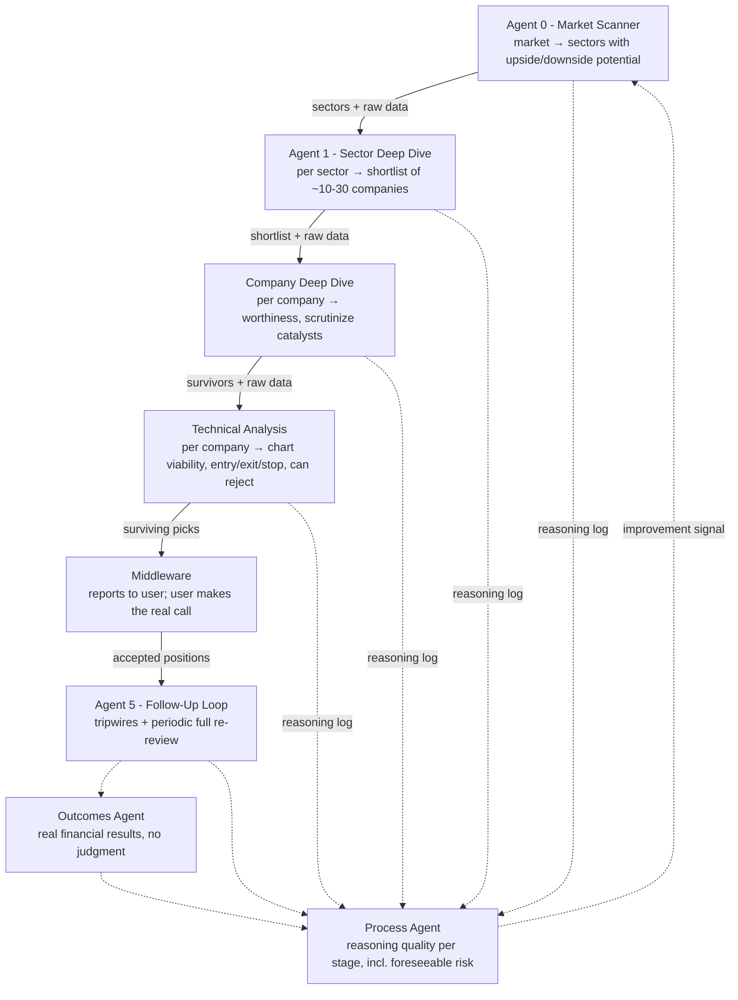

# Multi-Agent Trading Pipeline: Architecture

This is the design this codebase implements. Read it before changing any agent,
schema, or the middleware. The original design summary is kept in
[`architecture-summary.html`](architecture-summary.html). This file restates it
and adds the implementation decisions made during scaffolding (see
[Implementation decisions](#implementation-decisions)).

All market data comes from **Equibles** (see §6). It is a
**research and decision-support system**. It never places orders. A human makes
every go/no-go call.

## 1. Overview

The pipeline is a chain of independent agents. Each one handles one stage of
trade research and feeds the next stage. Agents within a stage run in parallel,
one per candidate and independently, to avoid correlated bias. Every agent
outputs structured reasoning with its verdict, not just pass/fail, so the
retrospective feedback loop can trace where judgment broke down.

Step-by-step runtime flow (sequence diagrams): [`sequence-diagrams.md`](sequence-diagrams.md).

## 2. Stage responsibilities

| Stage | Module | Runs | Input | Output |
|---|---|---|---|---|
| Agent 0: Market Scanner | `agents/market_scanner.py` | once per run | sector ETF performance + macro data | sectors with upside/downside potential |
| Agent 1: Sector Deep Dive | `agents/sector_deep_dive.py` | one per sector, in parallel | sector call + **bulk screen of every company in the sector** (key ratios, size, recent filings/events) + sector breadth, news, FDA, earnings | shortlist of ~10-30 companies, **ranked by potential score** |
| Company Deep Dive | `agents/company_deep_dive.py` | one per company, in parallel | shortlist entry + market/sector/macro data + **full company data** (fundamentals, recent SEC filings, 8-K events) | worthiness verdict; catalysts checked |
| Technical Analysis | `agents/technical_analysis.py` | one per company, in parallel, **no cross-comparison** | candidate + **investor profile** + price/indicator/pivot data **for each chart timeframe the investor's horizons need** + earnings calendar | chart verdict + entry / exit / stop-loss / horizon / chart timeframe, or rejection; then **deterministic rules** check the plan |
| Middleware | `middleware.py` | orchestrates | | report to the user |
| Agent 5: Follow-Up | `agents/follow_up.py` | on a schedule, per accepted position | position + investor profile + fresh data | cheap tripwire checks (price vs stop/target, **material** news only) with a **12h alert cooldown**, plus a deep full re-review on alert or at an interval |
| Outcomes Agent | `agents/outcomes.py` | per closed/marked position | price history | financial results only; **deterministic, no LLM, no judgment** |
| Process Agent | `agents/process_review.py` | per position | every stage's reasoning trail + outcome | per-stage reasoning-quality grades, foreseeable-risk check, improvement signals |

## 3. Design principles (non-negotiable)

1. **Sequential between stages, parallel and independent within a stage.** Each
   candidate gets its own unbiased pass. The technical stage never compares
   candidates with each other.
2. **Raw-data pass-through.** Each agent receives the prior agent's report
   **and** the raw data behind it, so a bad upstream filter can't fully blind
   the next stage. In code, every stage input carries the upstream report plus a
   `RawDataBundle`. Stages add to the bundle as it moves forward. **Scope:** a
   company's prompts carry market-level data plus everything about that company and
   its sector, but not other companies' rows (`RawDataBundle.filter`). Nothing about
   the company itself is ever dropped.
3. **Two independent filters.** Fundamental worthiness and technical
   tradeability are uncorrelated. Rejecting a fundamentally strong company on
   chart grounds is a normal outcome, not an error.
4. **Structured reasoning, not just verdicts.** Every agent logs what pushed it
   toward or away from its conclusion (`StageReasoning`). This log is the
   backbone of the feedback loop.
5. **The middleware reports in one direction only.** It reports pipeline output
   to the user. The user's manual accept/reject **never** feeds back into the
   system as if it were the system's own judgment. User decisions are stored
   apart from stage records, and the process agent cannot read them. The
   decision only controls whether a position enters the follow-up watch list.
6. **Split meta-review.** The outcomes agent (pure P&L, no judgment) and the
   process agent (reasoning quality) are decoupled. A well-reasoned trade that
   loses to a genuine black swan must not be penalized like a missed,
   foreseeable risk such as macro exposure.
7. **Swing or long-term horizons only, never day trading.** Cross-stage data
   staleness is therefore not a concern.

## 4. Investor profile, horizons and rules

**Investor profile** (`profile.py`, `PipelineConfig.profile`, example in
`profile.example.json`): who the pipeline works for, including risk tolerance, allowed
holding horizons, whether shorts are allowed, maximum loss per trade, minimum
reward:risk, target return, how stop/target hits are detected (`level_trigger`), and
free-text notes. It is the user's *preferences*, set up
front, not a decision, so showing it to agents does not break the one-way middleware
principle. The technical agent and Agent 5's full review read it, and the rules
enforce it.

**Horizons and chart timeframes.** Each horizon has its own charts; the technical
agent reads levels from the primary chart and trend from the context chart, and the
middleware fetches every timeframe the profile's horizons need.

| Horizon | Typical hold | Primary chart | Context chart | Earnings flag window |
|---|---|---|---|---|
| `short_term` | days to ~2 weeks | 1h, 30 days | 1d, 6 months | 14 days |
| `swing` | weeks to ~3 months | 1d, 1 year | 1w, 2 years | 45 days |
| `long_term` | months to years | 1w, 5 years | 1d, 1 year | 30 days |

Day trading is **not** supported: it conflicts with principle 7 (intraday data goes
stale while the pipeline runs). Adding it would need a decision to change that principle.

**Deterministic rules** (`rules.py`). Rules never make judgment calls: they catch
mechanical errors, enforce the profile and flag known risks. Every result is logged on
the stage record (`StageRecord.rules`), so the process agent can tell a rule veto from a
judgment failure. `reject` removes the candidate; `flag` warns the user in the report.

| Rule | Outcome | When |
|---|---|---|
| `plan_price_order` | reject | long needs stop < entry < target; short the reverse |
| `profile_horizon` | reject | plan horizon not in the profile's horizons |
| `chart_timeframe` | flag | plan levels not read from the horizon's primary chart |
| `profile_short` | reject | short plan (or downside sector call at Agent 1) when shorts are not allowed |
| `max_loss` | reject | stop further from entry than `max_loss_per_trade_pct` |
| `reward_to_risk` | reject | reward:risk below `min_reward_to_risk` |
| `stale_entry` | reject | price already more than `stale_entry_max_drift_pct` (3%) past the entry, or through the stop. Live runs use the live quote; backtests use the last close at `as_of`. A price that hasn't reached the entry yet is fine. |
| `upcoming_earnings` | flag | earnings inside the horizon's window, or the date is unknown |

**Conflicts** (`Conflict`, `PipelineReport.conflicts`): when the same ticker comes from
more than one sector call, it is **always recorded**, as `direction_conflict` (opposite
directions) or `duplicate`. The first surfacing advances; the record is stored and shown
in the report.

**Stop and target hits** follow the profile's `level_trigger`: `close` (default) counts
a hit only when a bar *closes* beyond the level; `intraday` counts it as soon as the bar's
low/high touches it. Agent 5's alerts and the outcomes agent share one function
(`rules.levels_hit`), so they always agree.

**Alerts** (Agent 5). A tripwire fires on price hitting the stop or target (per
`level_trigger`), or on **material** news. `rules.is_material` keeps SEC 8-Ks with material
items (e.g. 1.01, 2.02, 5.02), earnings, guidance, FDA, M&A, rating changes, offerings,
legal and leadership news, and drops price-action chatter, reiterations and listicles.
Each alert triggers a full re-review. After an alert, further alerts for the same
position are **held for 12 hours** (`alert_cooldown`). Anything that trips meanwhile is
recorded and delivered with the next alert, so nothing material is lost.

## 5. Design decisions

**Decided (2026-09-25):**

| Decision | Choice | Why |
|---|---|---|
| Agent 1 output format | **Ranked by potential score (0-100)**; passing companies are forwarded best-first, capped per sector. Pass/fail is still recorded. | Gives the feedback loop a gradient ("scored 85 and failed" teaches more than "passed and failed") and lets later stages triage. |
| Running confidence score | **Attribution only.** Recorded at every stage as a trajectory; gates nothing; hidden from downstream agents. | Traces where doubt entered without anchoring later agents or trusting uncalibrated scores. Revisit gating once testing shows calibration. |
| Agent 1 data | **Bulk screen at Agent 1, deep data later.** Agent 1 screens every company in the sector from cheap bulk data; full per-company fundamentals are fetched only for the shortlist. | Full fundamentals for a whole sector cost ~28 Equibles calls per company. |
| Raw-data pass-through scope | **Relevant subset**: market + sector + the company's own data. | Keeps the principle (no stage blinded by an upstream filter) at a fraction of the token cost of repeating every company's data in ~30 prompts. |

**Decided (2026-09-25, second round):**

| Decision | Choice |
|---|---|
| Data vendor | **Equibles for all data.** Anything Equibles doesn't provide is deferred, not sourced elsewhere. |
| Stop/target definition | **Customizable in the investor profile** (`level_trigger`: `close` or `intraday`), shared by alerts and outcomes. |
| Duplicate decisions | **Blocked.** A second accept/reject for the same candidate raises an error. |
| Cost | Not a concern for now; no budgets or caching work yet. |

**Open:**

- **Backtesting and forward (paper) testing.** Researched in
  [`testing-research.md`](testing-research.md). Recommendation (not yet decided): build
  it in-house and treat forward testing as the main evidence. Phase 0 is a forward
  "shadow ledger" of every recommendation, Phase 1 a replay harness over dates after the
  model's training cutoff, then analytics libraries and baselines. No broker needed. Known constraints:
  only dates after every model's training cutoff are honest evidence; prices should be
  survivorship-free and fundamentals point-in-time; a simulated decision policy must be
  stored apart from real user decisions; any broker paper-trading integration would
  relax the no-orders rule and needs an explicit decision.

**Future enhancements (not planned now):**

- **Day trading** as a horizon (would need principle 7 changed).
- **More rules:** liquidity floor, sector concentration across recommendations.
- **Own snapshots of scheduled-event calendars** (earnings, FDA). Not needed if Equibles
  keeps the dates *as they were expected at the time*; worth revisiting if backtests
  show it doesn't.
- **Cost controls:** token/cost tracking, per-run budgets, prompt caching, condensing
  long price histories in prompts.
- **Real-model evaluation:** test prompt quality against the real model with an
  evaluation set, once the system is complete.

## 6. Data requirements

Every category needs a **live** version (to run the system) and a **deep
historical, point-in-time** version (to backtest it honestly):

- Price and volume
- Sector-level performance and breadth
- News and catalyst events (earnings, FDA, analyst actions)
- Company fundamentals (financials, filings, ownership, valuation)
- Macro data (rates, inflation, FX), for the foreseeable-risk checks

**Vendor: Equibles** (hosted MCP at `https://mcp.equibles.com/mcp`, plus REST). Anything
it doesn't provide is **deferred**. Agents still depend only on the provider interfaces
in `data/base.py`, so this stays swappable.

| Need | Equibles tools | Adapter | Notes |
|---|---|---|---|
| Company fundamentals | `GetFinancialFact` | **Built**: `data/equibles.py` `EquiblesFundamentals` | Point-in-time by filing date; see below |
| Daily/weekly prices, indicators, support/resistance | `GetStockPrices` | **Built**: `data/equibles_prices.py` `EquiblesPrices`, math in `data/technicals.py` | Weekly bars and all indicators/pivots computed locally. A bar counts from 16:00 ET on its date. **Backtest caveat:** Equibles restates the whole history after each split and exposes no split events, so past absolute levels reflect later splits (percent moves and indicator shapes are unaffected). |
| Quotes | `GetLiveQuote` (Cloud), `GetLatestClosingPrices` | **Built**: `EquiblesQuotes` | Live quote first (Plus: 15-min delayed, Pro: real-time); falls back to the last close, saying why (e.g. Free plan). The live table format is only confirmed once on Plus: run `trading-pipeline check`. |
| Intraday (1h) bars | Cloud-only | Gap | Needed for `short_term`; tool reference needed |
| Sector performance (Agent 0) | `GetStockPrices` on SPY + the 11 sector ETFs | **Built**: `data/equibles_sectors.py` `EquiblesSectorData` | 1w/1m/3m/6m/YTD returns, 50/200-day MA position, vs benchmark |
| Sector screen and breadth (Agent 1) | `GetEtfHoldings` (Cloud; ETF NPORT-P holdings with tickers), `GetStockPrices`; fallback `GetFundProfile` + `GetInstitutionPortfolio` (name-to-ticker) | **Built**: `EquiblesSectorData` | Constituents = the sector ETF's top holdings (default 25), usable once the report would have been public (period + 60 days). Only the latest holdings report is served, so older backtests get gaps. Screen has price-based fields; ratios (`ScreenStocks`, `GetValuationMultiples`) not yet wired. |
| SEC filings | `ListFilings` | **Built**: `data/equibles_events.py` `EquiblesFilings` | 10-K/10-Q/8-K, known from the day after filing |
| Catalyst events | `ListFilings`, `GetFdaAdvisoryCommitteeMeetings`, `GetInvestorRelationsNews` (Cloud) | **Built**: `EquiblesNews` | 8-Ks normalised to events (category from items); company press releases from IR sites (known from the day after publication; partial coverage, gaps are noted); FDA advisory meetings for healthcare sectors, visible 15 days ahead |
| Earnings date | `GetUpcomingInvestorEvents` (Cloud), `ListFilings` (8-K item 2.02 history) | **Built**: `EquiblesNews.upcoming_earnings` | Live runs: the company's announced date (`confirmed: true`) when its IR calendar has one. Backtests and companies without one: estimate from past results filings (`confirmed: false`). The IR calendar lists future events only, so it is never used for a past `as_of`. |
| Macro | `GetEconomicIndicator`, `GetEconomicCalendar`, `GetVixHistory`, `GetPutCallRatios` | **Built**: `data/equibles_macro.py` `EquiblesMacro` | 13 FRED series, VIX, put/call, next 14 days of releases. A value counts only after its period ends plus a conservative publication lag. Latest-revised values (no vintages). |
| Transcripts, guidance, screener ratios, analyst estimates | Cloud (`GetEarningsCallTranscript`, `GetGuidance`, `ScreenStocks`, `GetValuationMultiples`, `GetAnalystEstimates`) | Later | Available on the connector; not yet wired |
| Third-party general news, PDUFA dates, macro vintages, FOMC dates | Not provided | **Deferred** | |

The provider wiring (`app.py`) loads every adapter and builds the `HttpMcpClient` allowlist
from the tools they declare (`TOOLS`); all are read-only Get/List tools. Equibles' account
tools (portfolios, lots, watches) are never on it.

**Verified against the hosted server:** every tool above was called through the Equibles
connector and the real responses are replayed through the adapters in
`tests/test_equibles_live_formats.py` (fixtures in `tests/fixtures/equibles_live`). Before a
run, `trading-pipeline check` calls every provider once and fails on missing data.

**Fundamentals connector:** for each concept it asks `GetFinancialFact` for both the
originally reported and the latest restated values, each carrying its filing date, and
keeps only rows filed on an earlier US/Eastern day than `as_of`. For each period the latest
such filing wins, so a restatement counts only after it was filed. (Only a middle
restatement of a period restated twice can be missed.) Caveats:
- Equibles adjusts per-share values to today's share basis. In backtests that reveals
  future splits, so those values are dropped and noted.
- The hosted tool resolves tickers to today's company, so a reused ticker can point at the
  wrong company in old backtests. The payload names the company so this is visible.
- 2 calls per concept (28 per ticker by default), so real runs need the Plus plan.
`EquiblesPostgresFundamentals` is the exact, self-hosted alternative.

Background research that led here: [`data-sources-research.md`](data-sources-research.md),
[`live-prices-research.md`](live-prices-research.md),
[`equibles-evaluation.md`](equibles-evaluation.md).

Gaps are modeled as provider interfaces with `Unavailable*` implementations.
Their snapshots carry `is_gap=True`, so agents are told the data is missing
rather than silently seeing nothing, and the process agent can separate "bad
reasoning" from "no data".

## 7. Overall assessment (from the design discussion)

- The architecture is sound. Whether it makes money is **unknown and must not
  be assumed**. The design's value is that it is honest and falsifiable.
- **Overfitting risk:** keep a held-out validation period that the system was
  never tuned against (`PipelineConfig.holdout_start`). Weight the process
  agent's reasoning-quality signal, not only outcomes.
- **The model already knows the past.** Any backtest dated before an LLM's training
  cutoff can leak outcomes that no point-in-time data fixes. Only results from dates
  after the training cutoff of every model used count as honest evidence, so set
  `holdout_start` accordingly.
- Expect early versions to be mediocre or to lose money. That is the system
  surfacing weak reasoning.

## Implementation decisions

Choices made while scaffolding. Each one is easy to revisit.

| Topic | Decision | Where |
|---|---|---|
| Language / LLM | Python 3.11+, the official `anthropic` SDK, structured outputs via `client.beta.messages.parse` with Pydantic models, adaptive thinking, server-side refusal fallbacks (`fallbacks="default"`). Model and effort are set in config. | `llm.py`, `config.py` |
| Agent 1 format (**decided: ranked**) | The schema records **both** a `potential_score` (0-100) and a `passed` flag per company, so both are always logged. `PipelineConfig.shortlist_mode` defaults to `"ranked"`; `"pass_fail"` remains available. | `schemas.py`, `middleware.py` |
| Confidence score (**decided: attribution only**) | Every stage emits a 0-1 `confidence` for each candidate. It is stored as a trajectory on the `Candidate` (`confidence_trajectory`) and used for attribution. **It gates nothing by default** (`confidence_gate=None`), and **downstream agents don't see upstream confidence numbers by default** (`show_upstream_confidence=False`) to avoid anchoring. | `schemas.py`, `middleware.py` |
| Agent 1 bulk screen | `SectorDataProvider.sector_screen` returns one `screen` snapshot per company (subject = ticker). The company deep dive filters the sector bundle to market + sector + its own ticker before adding full company data. | `data/base.py`, `middleware.py` |
| Investor profile & rules | `InvestorProfile` in config; `rules.py` holds all deterministic checks as pure functions; results are logged per stage record and shown as flags in the report. | `profile.py`, `rules.py`, `middleware.py` |
| Alerts | Material-news filter plus 12h per-position cooldown with held reasons delivered later. | `rules.py`, `agents/follow_up.py` |
| Point-in-time data | Every provider call takes `as_of`. `RawDataBundle.add` rejects a snapshot dated after the run's `as_of`, which guards against look-ahead in backtests. | `data/base.py` |
| Data access | The middleware fetches data through provider interfaces, not the agents. All adapters are Equibles (§6). MCP calls go through `HttpMcpClient`, which only calls allowlisted tools. Any quotes/account adapter must have **no order methods**. | `data/base.py`, `data/mcp.py`, `data/equibles.py` |
| User decisions | Stored in a separate table. `Store.review_trail()` (what the process agent reads) never includes them. One decision per candidate; a second is rejected. | `store.py`, `middleware.py` |
| Outcomes agent | Plain deterministic code, no LLM, so "no judgment" holds by construction. | `agents/outcomes.py` |
| Process → Agent 0 improvement | Improvement signals are stored as `ImprovementNote`s with `approved=False`. Only human-approved notes are injected into stage prompts. This guards against the loop overfitting to recent outcomes. | `agents/process_review.py`, `agents/base.py` |
| Follow-up scheduling | Agent 5 exposes `tick(now)`. Every tick runs the cheap tripwire check; a full re-review runs when an alert is raised (subject to the 12h cooldown) or `full_review_interval` has passed. An external scheduler (cron, etc.) calls it. | `agents/follow_up.py` |

## Remaining work

**Built:** every Equibles adapter (§6), verified against real hosted responses; the
`trading-pipeline` CLI including `check` and the `run --max-sectors/--shortlist` limits
([`operations.md`](operations.md)); macro data for every stage; filings, 8-Ks and press
releases for the company deep dive; the announced earnings calendar on live runs.

**For the first run:**
1. **Equibles Plus** (the Free plan's 100 calls/day can't cover a run; Plus also turns on
   live quotes). **Anthropic API key.** Your investor profile.
2. **Where to run:** your machine, or this cloud environment with `mcp.equibles.com`
   allowed and both keys set as secrets.
3. `trading-pipeline check`, then a small `run --max-sectors 1 --shortlist 3`, then a full run.

**Still open:**
- **Testing** (§5): approve Phase 0 of [`testing-research.md`](testing-research.md) (a daily
  record of every recommendation) so evidence starts with the first run.
- **More Cloud tools** (not needed for a first run): screener ratios for Agent 1,
  guidance, analyst estimates and transcripts for the company deep dive.
- **News filter for biotech 8-Ks** filed under items 7.01/8.01 (needs the filing text).

**Future enhancements:** see §5.
