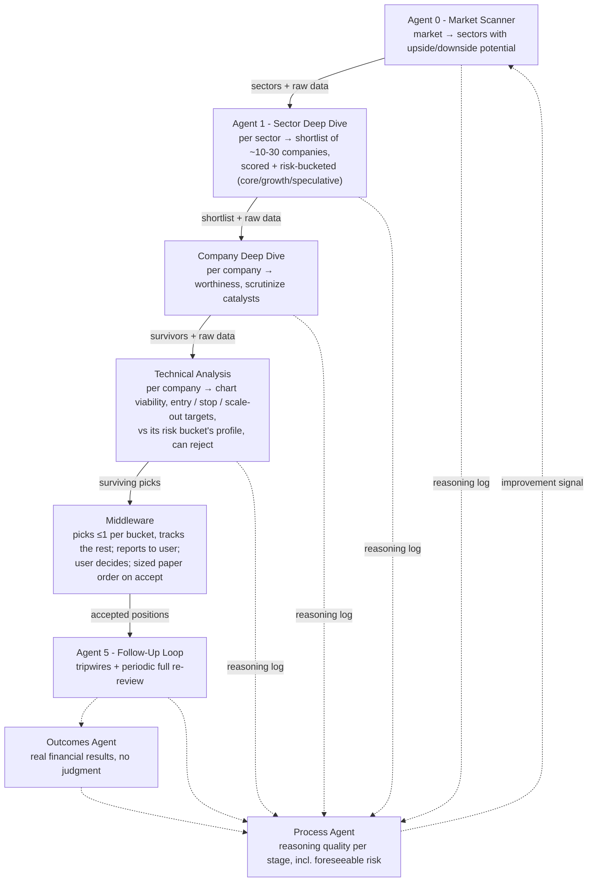

# Multi-Agent Trading Pipeline: Architecture

This is the design the pipeline implements: its principles, rules and decisions. Read
it before changing any agent, prompt or command. **How** it is implemented (Claude
Code subagents, prompts, hooks, the workspace) is in
[`prompt-subagents-design.md`](prompt-subagents-design.md). The original design summary
is kept in [`architecture-summary.html`](architecture-summary.html).

All market data comes from **Equibles** (see §6). It is a
**research and decision-support system**. A human makes every go/no-go call
(`/decide`); the system does not place orders on its own initiative. Since 2026-09-28,
the user can optionally have `/trade` place the resulting order for forward testing,
but only against a **paper** brokerage account (§5) — never a live one.

## 1. Overview

The pipeline is a chain of independent agents. Each one handles one stage of
trade research and feeds the next stage. Agents within a stage run in parallel,
one per candidate and independently, to avoid correlated bias. Every agent
outputs structured reasoning with its verdict, not just pass/fail, so the
retrospective feedback loop can trace where judgment broke down.

```mermaid
flowchart TD
    A0["Agent 0 - Market Scanner<br/>market → sectors with upside/downside potential"]
    A1["Agent 1 - Sector Deep Dive<br/>per sector → shortlist of ~10-30 companies,<br/>scored + risk-bucketed (core/growth/speculative)"]
    A2["Company Deep Dive<br/>per company → worthiness, scrutinize catalysts"]
    A3["Technical Analysis<br/>per company → chart viability, entry / stop / scale-out targets,<br/>vs its risk bucket's profile, can reject"]
    MW["Middleware<br/>picks ≤1 per bucket, tracks the rest; reports to user;<br/>user decides; sized paper order on accept"]
    A5["Agent 5 - Follow-Up Loop<br/>tripwires + periodic full re-review"]
    OUT["Outcomes Agent<br/>real financial results, no judgment"]
    PROC["Process Agent<br/>reasoning quality per stage, incl. foreseeable risk"]

    A0 -->|sectors + raw data| A1
    A1 -->|shortlist + raw data| A2
    A2 -->|survivors + raw data| A3
    A3 -->|surviving picks| MW
    MW -->|accepted positions| A5
    A5 -.-> OUT
    A5 -.-> PROC
    A0 & A1 & A2 & A3 -.reasoning log.-> PROC
    OUT -.-> PROC
    PROC -.improvement signal.-> A0
```

Step-by-step runtime flow (sequence diagrams): [`sequence-diagrams.md`](sequence-diagrams.md).

## 2. Stage responsibilities

| Stage | Agent (prompts in `prompts/<agent>/`) | Runs | Input | Output |
|---|---|---|---|---|
| Agent 0: Market Scanner | `market-scanner` | once per run | sector ETF performance + macro data | sectors with upside/downside potential |
| Agent 1: Sector Deep Dive | `sector-deep-dive` | one per sector, in parallel | sector call + **bulk screen of the sector's companies** (ratios, size, prices, recent filings/events) + breadth, FDA, earnings | shortlist **ranked by potential score**, each with a **risk bucket** (§4a) |
| Company Deep Dive | `company-deep-dive` | one per company, in parallel | shortlist entry + market/sector/macro data + **full company data** (fundamentals, filings, guidance, estimates, transcripts, insider and short data) | worthiness verdict; catalysts checked |
| Technical Analysis | `technical-analysis` | one per company, in parallel, **no cross-comparison** (benchmarks only: SPY and its sector ETF) | candidate + its **sector ETF** (in the brief) + its **bucket's risk profile** + price statistics (returns, MAs and their slopes, 30-week MA, ATR, RSI, MACD, VWAP, relative volume, volume and volatility lines), swing levels and weekly bars for the horizon's charts + **relative-strength lines vs SPY and the sector ETF** (and the ETF vs SPY) + VIX + earnings date | a structured **chart read** (stage, structure, volume, volatility, relative context, regime) + chart verdict + entry / stop / scale-out targets / horizon / chart timeframe / entry deadline, or rejection; then the **bucket's rules** |
| Middleware | the commands in `.claude/commands/` | orchestrates | | recomputes every plan, picks **≤1 recommendation per bucket** (the rest "also passed"), reports to the user with charts; records decisions and places the sized **paper** entry order on accept |
| Agent 5: Follow-Up | `follow-up` | on a schedule, per accepted position | position + profile + fresh data + every earlier analysis | tripwire checks (price vs stop / each target, missed or **expired** entry, **max hold**, **material** news only) with a **12h alert cooldown**, plus a full re-review on alert or every 14 days |
| Evaluation | `stage-evaluator` | per agent and past run | the agent's analyses + prices since | **outcome facts** (no judgment), then **reasoning-quality grades** with an attribution per miss |
| Feedback | `stage-feedback` | per agent, on request | the agent's evaluations | proposed lessons; added to prompts only after the user approves |

## 3. Design principles (non-negotiable)

1. **Sequential between stages, parallel and independent within a stage.** Each
   candidate gets its own unbiased pass. The technical stage never compares
   candidates with each other.
2. **Raw-data pass-through.** Each agent receives the prior agent's report
   **and** the raw data behind it, so a bad upstream filter can't fully blind
   the next stage. Every Equibles response an agent receives is saved to its analysis
   folder's `raw/`, and the next agent reads the upstream analysis and its `raw/`.
   **Scope:** a company's agents read market-level data plus everything about that
   company and its sector, but not other companies' files. Nothing about the company
   itself is ever dropped.
3. **Two independent filters.** Fundamental worthiness and technical
   tradeability are uncorrelated. Rejecting a fundamentally strong company on
   chart grounds is a normal outcome, not an error.
4. **Structured reasoning, not just verdicts.** Every agent logs what pushed it
   toward or away from its conclusion (factors with evidence, risks weighed, data gaps,
   confidence; `prompts/shared.md`). This log is the
   backbone of the feedback loop.
5. **The middleware reports in one direction only.** It reports pipeline output
   to the user. The user's manual accept/reject **never** feeds back into the
   system as if it were the system's own judgment. User decisions are stored
   apart from stage records, and the process agent cannot read them. The
   decision only controls whether a position enters the follow-up watch list.
6. **Split meta-review.** The outcomes agent (pure P&L, no judgment) and the
   process agent (reasoning quality) are decoupled. A well-reasoned trade that
   loses to a genuine black swan must not be penalized like a missed,
   foreseeable risk such as macro exposure.
7. **Swing or long-term horizons only, never day trading.** Cross-stage data
   staleness is therefore not a concern.

## 4. Investor profile, horizons and rules

**Investor profile** (`workspace/profile.json`, example in `profile.example.json`): who the pipeline works for. It holds settings shared across every
trade (whether shorts are allowed, how stop/target hits are detected — `level_trigger`
—, the maximum hold per horizon and free-text notes) plus a **`buckets` map: one
complete risk profile per risk bucket** (§4a): allowed and preferred horizons, entry
style, maximum loss per trade, minimum reward:risk, target return, how many scale-out
targets, position size as a percentage of the account and how long an untriggered entry
stays valid. It is the user's *preferences*, set up front, not a decision, so showing it
to agents does not break the one-way middleware principle. The technical agent and
Agent 5's full review read it, the rules enforce it, and the middleware sizes paper
orders from it.

### 4a. Risk buckets

Agent 1 (sector deep dive) assigns every company it passes a **`risk_bucket`** —
`core`, `growth` or `speculative` — alongside its `potential_score`. This is a second,
independent axis: `potential_score` is *conviction* (how likely the thesis plays out);
`risk_bucket` is *reward shape* (how large a move the thesis implies if it does).
Combining them into one 0-100 score would hide that a high-conviction, small-catalyst
company and a low-conviction, binary-catalyst company are different kinds of trade, not
different points on the same ladder. A company with neither a real case nor a
meaningful catalyst doesn't get a bucket at all — it's `passed: false`, same as today.

- **Assigned once, at Agent 1, and never re-scored downstream.** Company deep dive and
  technical analysis do not change it. This keeps one company mapped to exactly one
  candidate; letting later stages re-bucket (or bucketing the same ticker multiple ways)
  would fork a candidate into several plans and multiply the conflict-tracking below.
- **Magnitude comes from the catalyst, not the chart.** The bucket is set from the
  *type and size of the catalyst* Agent 1 found (a binary regulatory or M&A event
  implies a bigger move than a dividend hike or a routine estimate beat), never from
  price volatility (ATR, historical range). Volatility is a **technical** signal; using
  it at Agent 1 would blur principle 3 (fundamental and technical are independent
  filters) by letting a chart-shaped judgment leak into the fundamental screen.
- **The bucket selects a profile, not a plan.** Technical analysis still derives entry,
  stop and targets from chart structure alone — a bucket never dictates a literal stop
  distance a chart doesn't support. What the bucket picks is *which* profile from
  `profile.json`'s `buckets` map applies. Each bucket's profile shapes the trade in
  five ways, so that a `core` and a `speculative` plan genuinely differ and not only in
  the caps they clear: the **limits** (`max_loss_per_trade_pct`, `min_reward_to_risk`,
  `target_return_pct`), the **horizon** (`horizons` allowed, `preferred_horizon` the
  default — core leans `long_term`, speculative is swing-only), the **entry style**
  (`pullback` buys support inside a trend, `breakout` buys a confirmed break of
  resistance, `either`; a mismatch is a flag), the **scale-out** (`max_targets`: core
  takes one target, speculative up to three), and the **size** (`position_size_pct` of
  the account, e.g. core 3% / growth 2% / speculative 1%) plus how long the entry stays
  valid (`entry_valid_trading_days`). A `core` company that can't produce a plan inside
  the `core` profile is rejected, same as any other rule failure — its levels are never
  loosened to fit.
- **Carried through, not recomputed.** The bucket travels with the candidate from the
  "Forwarded" list through company deep dive (unused there, kept for the record) to
  technical analysis, and into the position file, so follow-up's full re-review checks
  a new plan against the same bucket's profile and the paper order is sized from it.

### 4b. From eligible to recommended, and into the paper account

- **Eligible ≠ recommended.** A candidate is *eligible* when it passes every stage and
  the middleware's own recomputation of its plan. From the eligible candidates the
  middleware recommends **at most one per bucket**: the highest *pick score*
  (company-deep-dive confidence × technical-analysis confidence; ties on
  `potential_score`, then reward:risk). The rest are listed in the report as **"also
  passed"** — visible, decidable, never hidden — and the evaluator grades them exactly
  like the picks. That shadow ledger is what tests the pick rule: if the also-passed
  outperform the picks, the rule is wrong and the feedback loop should say so. The
  middleware never re-ranks on its own judgment.
- **Scale-out targets.** A plan carries `targets: [{price, fraction}]`, nearest first,
  fractions summing to 1, at most the bucket's `max_targets`, each at a level the chart
  supports; `target` is the size-weighted mean and is what the ratio rules use. Scaling
  *in* (multiple entries) is deliberately not supported: it blurs max-loss, "was the
  entry filled" and the entry deadline; revisit after partial exits have been observed
  in follow-up.
- **Deadlines.** `entry_valid_until` (from the bucket's `entry_valid_trading_days`) —
  an entry not triggered by then expires and the position is closed as never opened;
  `max_hold_trading_days` per horizon (profile-wide) — a position held longer triggers
  a full re-review with `exit` as the default recommendation.
- **Paper execution on accept.** `/decide accept` records the decision as before and
  then, if paper credentials are present, sizes the entry from the account's equity and
  the bucket's `position_size_pct` (`qty = floor(size × equity / entry)`) and places a
  **stop-limit or limit order at the plan's entry** (never a market order: the entry
  condition *is* the price), good till cancelled; `/follow-up` records the fill or
  cancels it at expiry. Stops and targets are watched by the follow-up agent, not
  parked at the broker, and every exit is still the user's command. Execution stays
  paper-only, middleware-only and user-triggered, as CLAUDE.md requires.

**Horizons and chart timeframes.** Each horizon has its own charts; the technical
agent reads levels from the primary chart and trend from the context chart, and
fetches every timeframe the profile's horizons need.

| Horizon | Typical hold | Primary chart | Context chart | Earnings flag window |
|---|---|---|---|---|
| `swing` | weeks to ~3 months | 1d, 1 year | 1w, 2 years | 45 days |
| `long_term` | months to years | 1w, 5 years | 1d, 1 year | 30 days |

Day trading is **not** supported: it conflicts with principle 7 (intraday data goes
stale while the pipeline runs). Adding it would need a decision to change that principle.

**Rules** (`prompts/technical-analysis/role.md`). Rules never make judgment calls: they
catch mechanical errors, enforce the profile's **bucket** and flag known risks. The
technical agent applies every rule to its own plan, against the limits of the
candidate's `risk_bucket`, and records each result with its numbers; the middleware
recomputes price order, max loss and reward:risk against the same bucket before
recommending (a mismatch blocks the recommendation). The evaluator can therefore tell a
rule veto from a judgment failure. `reject` removes the candidate; `flag` warns the user
in the report.

| Rule | Outcome | When |
|---|---|---|
| `plan_price_order` | reject | long needs stop < entry < every target; short the reverse |
| `targets_shape` | reject | more targets than the bucket's `max_targets`, fractions not summing to 1, or not ordered nearest-first |
| `profile_horizon` | reject | plan horizon not in the candidate's bucket's horizons |
| `entry_style` | flag | entry not in the bucket's `entry_style` (pullback / breakout) |
| `chart_timeframe` | flag | plan levels not read from the horizon's primary chart |
| `profile_short` | reject | short plan when shorts are not allowed; downside sector calls are then not pursued |
| `max_loss` | reject | stop further from entry than `max_loss_per_trade_pct` |
| `reward_to_risk` | reject | reward:risk below `min_reward_to_risk`, measured to the size-weighted target |
| `stale_entry` | reject | price already more than `stale_entry_max_drift_pct` (3%) past the entry, or through the stop. Live runs use the live quote; backtests use the last close at `as_of`. A price that hasn't reached the entry yet is fine. |
| `upcoming_earnings` | flag | earnings inside the horizon's window, or the date is unknown |
| `market_regime` | flag | a long while SPY closes below a falling 200-day average (a short: above a rising one), or no SPY data. A flag, not a reject: the regime is context for the user, and whether flagged plans do worse is left to the evaluator to show. |

**Conflicts:** when the same ticker comes from
more than one sector call, it is **always recorded**, as `direction_conflict` (opposite
directions) or `duplicate`. The first surfacing advances; the record is stored and shown
in the report.

**Stop and target hits** follow the profile's `level_trigger`: `close` (default) counts
a hit only when a bar *closes* beyond the level; `intraday` counts it as soon as the bar's
low/high touches it. The follow-up agent and the evaluator use the same definition.

**Alerts** (Agent 5). A tripwire fires on price hitting the stop or target (per
`level_trigger`), or on **material** news. The follow-up agent keeps SEC 8-Ks with material
items (e.g. 1.01, 2.02, 5.02), earnings, guidance, FDA, M&A, rating changes, offerings,
legal and leadership news, and drops price-action chatter, reiterations and listicles.
Each alert triggers a full re-review. After an alert, further alerts for the same
position are **held for 12 hours**. Anything that trips meanwhile is
recorded and delivered with the next alert, so nothing material is lost.

## 5. Design decisions

**Decided (2026-09-25):**

| Decision | Choice | Why |
|---|---|---|
| Agent 1 output format | **Ranked by potential score (0-100)**; passing companies are forwarded best-first, capped per sector. Pass/fail is still recorded. | Gives the feedback loop a gradient ("scored 85 and failed" teaches more than "passed and failed") and lets later stages triage. |
| Running confidence score | **Attribution only.** Recorded at every stage as a trajectory; gates nothing; hidden from downstream agents. | Traces where doubt entered without anchoring later agents or trusting uncalibrated scores. Revisit gating once testing shows calibration. |
| Agent 1 data | **Bulk screen at Agent 1, deep data later.** Agent 1 screens every company in the sector from cheap bulk data; full per-company fundamentals are fetched only for the shortlist. | Full fundamentals for a whole sector cost ~28 Equibles calls per company. |
| Raw-data pass-through scope | **Relevant subset**: market + sector + the company's own data. | Keeps the principle (no stage blinded by an upstream filter) at a fraction of the token cost of repeating every company's data in ~30 prompts. |

**Decided (2026-09-25, second round):**

| Decision | Choice |
|---|---|
| Data vendor | **Equibles for all data.** Anything Equibles doesn't provide is deferred, not sourced elsewhere. |
| Stop/target definition | **Customizable in the investor profile** (`level_trigger`: `close` or `intraday`), shared by alerts and outcomes. |
| Duplicate decisions | **Blocked.** A second accept/reject for the same candidate is refused. |
| Cost | Not a concern for now; no budgets or caching work yet. |

**Decided (2026-09-25/26, the subagent build):**

| Decision | Choice |
|---|---|
| Architecture | **Prompt-based Claude Code subagents** that fetch their own data; the Python pipeline was removed on 2026-09-26. Details, and decisions D0-D5, in [`prompt-subagents-design.md`](prompt-subagents-design.md). |
| Your trade in evaluation (D0) | Evaluation grades agents against the market; the comparison with your decisions goes to `decisions/reviews/` and is shown to you only, never to an agent. |
| Backtests (D1) | A gatekeeper agent builds point-in-time data packs, an auditor checks them, and backtest agents have no data tools. |
| Rules and outcomes (D3) | In prompts; the middleware recomputes the plan arithmetic. |
| Forward testing | Every live run is graded by the evaluators as outcomes arrive, including candidates nobody traded: the "shadow ledger" of [`testing-research.md`](testing-research.md), Phase 0. |
| Models (D5, revisited) | Per agent, in `.claude/agents/` (design doc §11). |

**Decided (2026-09-28):**

| Decision | Choice | Why |
|---|---|---|
| Risk buckets (§4a) | Agent 1 assigns each passing company a `risk_bucket` (`core`/`growth`/`speculative`) from conviction × catalyst-type magnitude, alongside `potential_score`; `profile.json` becomes a `buckets` map of per-bucket limits; technical analysis applies the candidate's bucket's limits. Assigned once at Agent 1, never re-scored downstream; magnitude comes from catalyst type, never chart volatility. | A single 0-100 score conflated conviction with reward shape ("safe and likely" vs. "risky but big" are different trade types, not different ranks). Fixing the bucket at Agent 1 keeps one company mapped to one candidate and keeps the fundamental/technical filters independent (principle 3). |
| One risk profile per bucket (§4a) | Each bucket is a **complete profile**: limits, allowed + preferred horizon, entry style, `max_targets`, `position_size_pct`, `entry_valid_trading_days`. Not several profiles per bucket. | With only caps differing, every plan looked the same; behaviour (size, horizon, entry style) is what makes a core trade and a speculative trade different. Several profiles per bucket would fork one candidate into several plans. |
| One recommendation per bucket (§4b) | The middleware recommends the highest pick score (company × technical confidence) per bucket; every other eligible candidate is reported as "also passed" and graded identically. | 22 recommendations from one run is a screen, not decision support; the also-passed shadow ledger is what tests whether the pick rule picks well. |
| Scale-out, not scale-in (§4b) | Plans carry up to `max_targets` targets with fractions; reward:risk uses the size-weighted target. Multiple entries are not supported. | Partial exits are the tractable half; multiple entries blur max-loss, fill detection and the entry deadline. |
| Deadlines (§4b) | `entry_valid_until` per plan (bucket's `entry_valid_trading_days`) and `max_hold_trading_days` per horizon; follow-up enforces both. | Untriggered breakout entries were live forever; there was no notion of a stale plan. |
| Paper order on accept (§4b) | `/decide accept` sizes the entry from account equity × `position_size_pct` and places a stop-limit/limit order at the plan's entry (GTC); `/follow-up` records fills and cancels at expiry. Stops/targets stay with the follow-up agent; exits remain the user's command. | Forward testing needs the sized entry actually in the paper account, and the bucket profile is where the size belongs. Kept middleware-only and user-triggered per the hard rules. |
| Shorts on by default | `profile.example.json` ships `allow_short: true`; the short path (mirrored rules, downside sector calls, `sell` entry / `buy` exit at the broker) is exercised but not yet validated by an isolated downside run. | The scanner's most confident calls are often downside; ignoring them halves the pipeline's reach. Verification is an operations step, not a design one. |
| Indicators in `price_stats.py` | RSI14, MACD(12,26,9), 20-bar VWAP and relative volume are computed by the hook from the bars already fetched; relative strength vs SPY comes from a second `GetStockPrices` call the technical agent makes (extended 2026-09-29: chart statistics and RS blocks, below). | Equibles has no RSI/MACD/VWAP tools; computing them from fetched bars is arithmetic, keeps Equibles the only source and keeps every number reproducible from `raw/`. |
| Charts in the report | `report.html` draws the primary-timeframe candlesticks, SMA20/50 and the plan's levels from the technical agent's own `raw/` bars; cards collapse to a one-line trade summary. No external chart source. | A TradingView-style feed would be a second data vendor and would not show the bars the agent actually reasoned over. |
| Broker paper trading | **Added, scoped to forward testing.** `scripts/broker_alpaca.py` places and checks orders against Alpaca's paper-trading endpoint only (hard-coded, no live-account path). It is a plain script, not an MCP tool or subagent capability: no agent definition lists it, so no stage/follow-up/evaluator agent can call it, and `.claude/hooks/workspace_guard.py` denies any subagent `Bash` call naming it as defense in depth. Only the middleware agent runs it, and only from `/trade`'s new `broker-buy`/`broker-sell`/`broker-status` modes, triggered solely by the user typing that command. A filled order is recorded exactly like a manually-reported trade (`entered`/`exited` on `position.md`), plus the order id (`broker_entry_order_id`/`broker_exit_order_id`, `prompts/formats.md`). | Relaxes the no-orders rule enough for forward testing without weakening the one-way middleware principle or the decisions firewall: execution still requires the user's explicit `/trade` command, and no agent gains a path to place or influence an order. |
| Alpaca MCP server | **Added, for interactive/manual use, not the pipeline.** `.mcp.json` adds the community `alpaca-mcp-server` (orders, positions, account, watchlists), with `ALPACA_PAPER_TRADE` pinned to the literal `"true"` in the checked-in config (not read from the environment), so flipping it to live trading requires a reviewed change to `.mcp.json` itself. No `.claude/agents/*.md` lists any `mcp__alpaca__*` tool, and `workspace_guard.py` denies the whole prefix to any subagent (`agent_id` set) as defense in depth — it is never a data source for an agent either (Equibles stays the only one). Only you, and the middleware agent if a command is later written to use it, can call it. | You wanted the full toolset (not just order submit/status) for hands-on testing against the real paper account; keeping it out of every subagent's tools and pinning paper mode in the repo (rather than trusting an env var) keeps the no-agent-execution guarantee and the paper-only guarantee both intact. |

**Decided (2026-09-29):**

| Decision | Choice | Why |
|---|---|---|
| Chart-reading method | The technical agent follows a fixed procedure (`prompts/technical-analysis/role.md`, "How to read the chart"): Weinstein stage on the 30-week MA and a trend template, swing structure and zones, base quality, volume (up/down volume, dry-up, breakout volume), momentum divergence (RSI14 at swing points), volatility (ATR trend, Bollinger-width percentile, stop distance in ATRs, extension from SMA50), relative context, then a synthesis with the failure modes an expert checks. The read is recorded as `chart`, `relative_strength` and `regime` in the frontmatter. It informs the verdict and the levels; it adds no reject rule. | The agent was mostly data gathering and profile rules, with no method for reading a chart. A fixed, numbered procedure on the statistics it actually gets makes the read repeatable and gradeable (evaluation checks whether the stage, trend and RS reads held). |
| Chart statistics in `price_stats.py` | The hook adds, for the technical agent: SMA50/SMA200 slopes (vs 20 bars earlier), the 30-week MA and its slope, the MA order and the close vs SMA50 in ATRs, ATR14 vs 20 bars earlier, Bollinger(20,2) width and its 126-bar percentile, 50-bar volume average, 10-bar dry-up, up/down volume and the heaviest bars, RSI14 at each swing point; and **relative-strength blocks** (RS line = close / benchmark close on common dates: return differences, RS highs/lows, RS vs its 50-date mean, the stock during the benchmark's deepest pullback) whenever a folder holds the stock and SPY, the stock and its sector ETF, or the ETF and SPY. | Arithmetic only, reproducible from `raw/`, and far more reliable than asking the model to divide 250 closes. The RS block is computed when the second ticker of a pair arrives (the hook reads the other response from the same `raw/` or pack), so parallel fetches still produce it. |
| Sector ETF and regime for the technical agent | The middleware puts the candidate's sector and ETF (from the sector deep dive's `sector`/`etf`) in the technical brief; the agent fetches the ETF next to SPY. Regime comes from SPY's own statistics (close vs a rising/falling SMA200) plus VIX (`GetVixHistory` added to the agent's tools; the gatekeeper already serves VIX in backtests). It does **not** read the market scanner's calls or macro series. New `market_regime` **flag**. In isolation mode without a sector in the brief, the agent reads against SPY only and records the gap. | Relative strength vs the market and the group is core chart work, and all of it is price data. VIX by tool (one read-only call, same in every mode) is simpler than routing the scanner's `raw/` to a stage that doesn't otherwise read it, and keeps the scanner's sector judgment from anchoring the chart read (principle 3). Magnitude still comes from the catalyst: the regime never changes the bucket. |

**Open:**

- **Sector ETF in isolation runs.** `/run-agent technical-analysis <ticker>` has no sector
  unless the user names one; the agent then records the gap. A lookup (e.g.
  `GetEtfProfile`/`GetEtfHoldings` membership) would need a tool the agent doesn't have.
- **Scanner regime vs the agent's own.** The technical agent derives the regime from SPY
  and VIX itself; the market scanner's broader macro read is not passed to it. Revisit if
  evaluations show macro-driven misses the chart couldn't see.
- **Plan margins.** Recommendations have repeatedly sat right at the profile's limits
  (e.g. max loss 7.8% vs 8%, reward:risk 2.03 vs 2.0). Whether plans should keep a
  margin from the limits is the user's call.
- **Short path validation.** Shorts are enabled but no downside sector has been run end
  to end since the bucket/profile redesign; one isolated `/run-agent` on a downside call
  (Utilities was the scanner's most confident call on 2026-09-28) should precede
  trusting a short recommendation.
- **Congressional trades** as a company-deep-dive input (Equibles has the tool; no agent
  lists it), and a **macro gate** at the recommendation stage (a flag for a
  high-importance release inside the horizon, mirroring `upcoming_earnings`): both
  tracked, neither decided.
- **Scale-in** (multiple entries): deferred until partial exits have been observed.

**Future enhancements (not planned now):**

- **Day trading** as a horizon (would need principle 7 changed).
- **More rules:** liquidity floor, sector concentration across recommendations.
- **Own snapshots of scheduled-event calendars** (earnings, FDA). Not needed if Equibles
  keeps the dates *as they were expected at the time*; worth revisiting if backtests
  show it doesn't.
- **Cost controls:** token/cost tracking and per-run budgets.
- **Real-model evaluation:** test prompt quality against the real model with an
  evaluation set, once the system is complete.

## 6. Data requirements

Every category needs a **live** version (to run the system) and a **deep
historical, point-in-time** version (to backtest it honestly):

- Price and volume
- Sector-level performance and breadth
- News and catalyst events (earnings, FDA, analyst actions)
- Company fundamentals (financials, filings, ownership, valuation)
- Macro data (rates, inflation, FX), for the foreseeable-risk checks

**Vendor: Equibles** (hosted MCP at `https://mcp.equibles.com/mcp`, configured in
`.mcp.json`). Anything it doesn't provide is **deferred**. Each agent may call only the
read-only tools listed in its definition (`.claude/agents/`); the account tools
(portfolios, lots, watches, reports) are denied for everyone.

| Need | Equibles tools | Used by | Notes |
|---|---|---|---|
| Daily prices, indicators, support/resistance | `GetStockPrices` (daily only, ≤500 rows per call), `GetAverageTrueRange`, `GetBollingerBands`, `GetStochasticOscillator`, `GetOnBalanceVolume` | scanner, sector, technical, follow-up, evaluator | For the scanner, sector and technical agents a hook replaces each price response with computed statistics (returns, 20/50/200-day averages, 52-week range, ATR14, dollar volume; for the technical agent also MA slopes, the 30-week MA, volume and volatility lines, swing levels with RSI14, weekly bars, and relative-strength blocks vs SPY and the sector ETF). A bar counts from 16:00 New York on its date. **Backtest caveat:** Equibles restates history after each split and exposes no split events, so past absolute levels reflect later splits (percent moves are unaffected). |
| Quotes | `GetLiveQuote`, `GetLatestClosingPrices` | technical, follow-up | Live quote on Plus (15-min delayed) or Pro; last close otherwise. Never in backtests. |
| Sector performance | `GetStockPrices` on SPY + the 11 sector ETFs | scanner; technical (SPY + the candidate's sector ETF, for relative strength) | |
| Sector constituents, screen and breadth | `GetEtfHoldings`, `ScreenStocks` (up to 200 tickers per call), `GetValuationMultiples`, `GetStockPrices` | sector | Constituents = the sector ETF's top 25 holdings, usable once public (period + 60 days). Only the latest holdings report is served, so older backtests get a gap (or survivorship-biased current holdings). |
| Fundamentals | `GetFinancialFact`, `GetFinancialStatement`, `GetValuationMultiplesHistory` | company | A figure counts from the day after its filing; as-reported values preferred. Per-share values are on today's share basis (dropped in backtests). |
| Filings and documents | `ListFilings`, `SearchDocument`, `ReadDocumentLines` | sector, company, follow-up | 10-K/10-Q/8-K; 8-K item numbers say what happened. |
| Company news and events | `GetInvestorRelationsNews`, `GetUpcomingInvestorEvents`, `GetFdaAdvisoryCommitteeMeetings` | sector, company, follow-up | Press releases from IR sites (partial coverage); announced earnings dates (live only); FDA advisory meetings visible 15 days ahead. |
| Expectations | `GetGuidance`, `GetAnalystEstimates`, `GetEarningsCallTranscript` | company | Estimates are "now only" (never in backtests). |
| Ownership and risk | `GetInsiderTransactions`, `GetShortInterest`, `GetDebtProfile`, `GetGoingConcernStatus` | company | |
| Macro | `GetEconomicIndicator`, `GetLatestEconomicIndicators`, `GetEconomicCalendar`, `GetVixHistory`, `GetPutCallRatios` | scanner (others read its `raw/`); technical: `GetVixHistory` only, for the regime | 13 FRED series; a value counts after its period ends plus the publication lag. Latest-revised values (no vintages). |
| Third-party news, PDUFA dates, macro vintages, FOMC dates | Not provided | | **Deferred** |

Backtests replace direct access with the gatekeeper's data packs; the per-tool
point-in-time rules are in `prompts/gatekeeper/role.md`.

Background research that led here: [`data-sources-research.md`](data-sources-research.md),
[`live-prices-research.md`](live-prices-research.md),
[`equibles-evaluation.md`](equibles-evaluation.md).

**Gaps are explicit.** A tool that fails or returns nothing is recorded as
`UNAVAILABLE`, and data an agent was asked for but didn't fetch as `NOT CHECKED`, so the
evaluator can separate "bad reasoning" from "no data".

## 7. Overall assessment (from the design discussion)

- The architecture is sound. Whether it makes money is **unknown and must not
  be assumed**. The design's value is that it is honest and falsifiable.
- **Overfitting risk:** keep a held-out validation period that the system was
  never tuned against (`PipelineConfig.holdout_start`). Weight the process
  agent's reasoning-quality signal, not only outcomes.
- **The model already knows the past.** Any backtest dated before an LLM's training
  cutoff can leak outcomes that no point-in-time data fixes. Only results from dates
  after the training cutoff of every model used count as honest evidence, so set
  `holdout_start` accordingly.
- Expect early versions to be mediocre or to lose money. That is the system
  surfacing weak reasoning.

## Implementation

Implemented as Claude Code subagents: see
[`prompt-subagents-design.md`](prompt-subagents-design.md) for the layout (prompts,
subagents, commands, hooks, workspace), how each principle above is enforced, the
backtest mode and the per-agent models, and [`operations.md`](operations.md) for
running it.

## Remaining work

**Built and run live:** the four research stages, the middleware and report, the
decisions firewall and raw-data capture (hooks), price statistics, a one-stage backtest.

**Built, not yet exercised end to end:** follow-up (`/follow-up`, `/trade`), evaluation
and feedback (`/evaluate`, `/feedback`, `/approve`), a full four-stage backtest, and the
new paper-trading path in `/trade` (`broker-buy`/`broker-sell`/`broker-status`), which
has not yet placed a real paper order against a live Alpaca paper account.

**Still open:**
- **Plan margins** (§5).
- **Sector screen stability:** the sector agent's ranking moved between runs at low
  effort (e.g. NVDA scored 88, 88, then 71); consider medium effort.
- **News filter for biotech 8-Ks** filed under items 7.01/8.01 (the follow-up agent reads
  the text, but the rule is untested).

**Future enhancements:** see §5.
