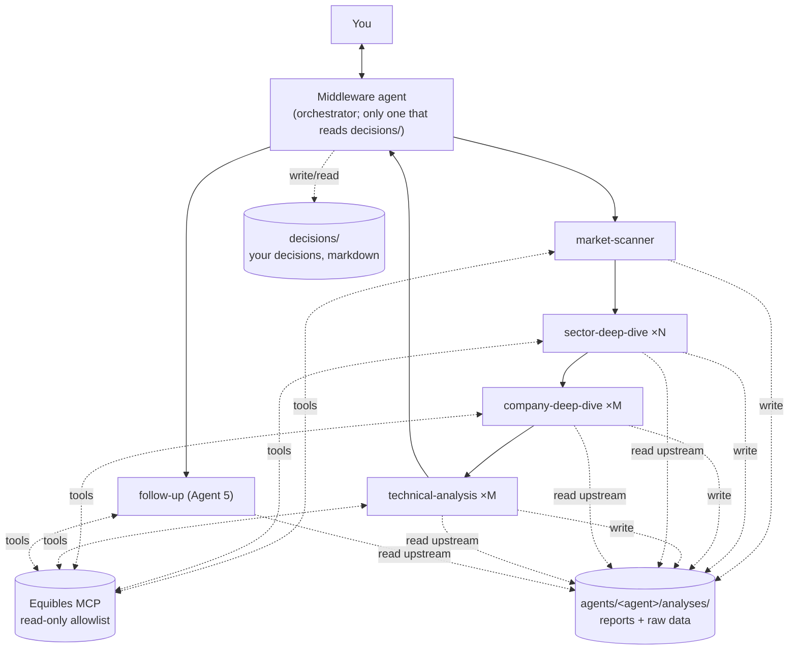
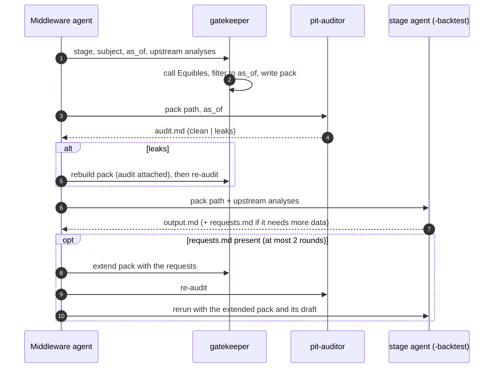

# The pipeline as prompt-based subagents

**Status: built and running (2026-09-26).** The system is prompt-based subagents only
(D4); the earlier Python pipeline was removed on 2026-09-26 (it is in git history). The
"Today (code)" column in §7 describes that Python version, for comparison.

This document describes how the pipeline is built: each stage is a prompt-defined
subagent that fetches its own data. It also lists what that costs against the
principles in [ARCHITECTURE.md](ARCHITECTURE.md), how the hooks enforce the critical
rules, and the decisions taken (§8).

Direction from the user (2026-09-25):

1. The orchestrator records the user's decisions in markdown files.
2. Each agent keeps a folder of its analysis runs. The folder is the agent's feedback
   record and the way raw data passes from one agent to the next.
3. Each agent has four prompts: **default** (end-to-end run), **isolation** (run on its
   own), **evaluation** (grade its past decisions, alongside the user's trade) and
   **feedback** (improve the agent from its analysis folder).
4. Agent 5 (follow-up) can read all of that data when it needs to.
5. A **middleware agent** is the orchestrator and the only interface between the
   agents and the user.

## 1. Why consider it

- **Much less code.** Stage behaviour lives in markdown prompts instead of ~5,800 lines
  of Python (agents, middleware, adapters, parsers).
- **Faster iteration.** Changing a stage means editing its prompt.
- **Agents can dig.** Today the middleware decides up front what each agent sees. A
  company agent that finds a doubtful catalyst could pull the 8-K, transcript, guidance
  or analyst estimates itself, instead of reporting a data gap.
- **Smaller outputs per call.** One analysis file per subject, instead of one large JSON
  reply per stage. This avoids the failure of the first live run (2026-09-25): the
  Utilities sector deep dive's 25-company JSON was cut off at `max_tokens`.

## 2. Shape



**Runtime.** Claude Code. The middleware agent is the main session, driven by slash
commands (interactive, or headless with `claude -p "/run ..."` for cron). It launches
each stage agent as a subagent. A subagent starts with a fresh context, so agents
within a stage stay independent (principle 1): each company agent sees only its own
brief.

**Stages hand off through the analysis folders, not the conversation.** The middleware
agent passes each agent the *paths* of its upstream analyses. Raw data still travels
with the report (principle 2), scoped as today: market + sector + the company's own data.

## 3. Repository layout (prompts, versioned)

```
prompts/
  <agent>/                       one folder per agent (list in §6)
    role.md                      shared by all modes: role, data rules, output format
    default.md                   end-to-end run: inputs come from upstream analyses
    isolation.md                 on its own: you give the subject, the agent fetches
                                 the context an upstream agent would have supplied
    evaluation.md                grade past analyses against what happened (§5)
    feedback.md                  read analyses + evaluations, propose improvements (§5)
    lessons.md                   approved improvements; role.md always includes it
    playbook/                    technical-analysis only: method (cheat-sheet.md every
                                 run, topic files 01-09 on demand, CONVENTIONS.md)
  middleware/
    role.md                      orchestration rules, the decisions firewall (§7)
    report.md                    how the report to you is written
    backtest.md                  backtest relay loop (§10)
  gatekeeper/role.md             backtest only: fetch + point-in-time filter (§10)
  pit-auditor/role.md            backtest only: independent check of each data pack (§10)

.claude/agents/                  subagent definitions (frontmatter: name, description,
  <agent>.md                       tools, model); default + isolation modes
  <agent>-evaluator.md           evaluation mode (different tools)
  <agent>-feedback.md            feedback mode (no market-data tools)
  <agent>-backtest.md            backtest mode: no Equibles tools, reads its data pack
  gatekeeper.md                  the only backtest agent with Equibles tools
  pit-auditor.md                 Read on data packs only

.claude/commands/                your entry points into the middleware agent
  run.md                         /run [--max-sectors N] [--shortlist N]
  backtest.md                    /backtest --as-of DATE [--max-sectors N] [--shortlist N]
  run-agent.md                   /run-agent <agent> <subject> [--as-of DATE]
                                 (isolation; a past date runs in backtest mode)
  decide.md                      /decide <candidate_id> accept|reject [note]
  trade.md                       /trade <position_id> entered|exited <price> [date] [fraction]
  follow-up.md                   /follow-up                      (cron)
  evaluate.md                    /evaluate [<agent>] [--since DATE]
  feedback.md                    /feedback <agent>
  approve.md                     /approve <agent> <proposal_id>
.claude/settings.json            Equibles MCP server, tool deny list (§7)
```

Modes are separate subagent files because they need different tools: evaluation needs
price data, feedback needs none. Each file's body tells the subagent to read
`prompts/<agent>/role.md` and the mode's prompt.

**Approval is a commit.** An approved feedback proposal is added to that agent's
`prompts/<agent>/lessons.md`. It is versioned in git, so every analysis can record the
prompt version (commit) it ran with, and a bad lesson can be reverted.

## 4. Workspace layout (data, outside git)

Analyses contain Equibles data and grow every day, so they stay out of git: they live
in `workspace/` at the repository root, which is git-ignored. Keeping it inside the
project lets Claude Code's project permissions and hooks cover it. The exact formats
the agents follow are in [`prompts/formats.md`](../prompts/formats.md).

```
workspace/
  runs/<run_id>/run.md                    manifest: as_of, mode (live | backtest), agents
                                          run, prompt commit, links to each analysis,
                                          point_in_time (backtests, §10)
  runs/<run_id>/packs/<stage>/<subject>/  backtests only: gatekeeper data pack + audit (§10)
  agents/<agent>/
    analyses/<run_id>/<subject>/          subject = "market", a sector or a ticker
      output.md                         the agent's output (format below)
      raw/<tool>-<n>.json                 every tool result it used, verbatim
    evaluations/<eval_id>.md              evaluation-mode output
    feedback/<proposal_id>.md             feedback proposals, status: pending|approved|rejected
  positions/<position_id>/
    position.md                           the plan being watched (from the technical analysis)
    alerts.md                             tripwire log (price, clock and news alerts)
    reviews/<date>.md                     Agent 5 re-reviews
  decisions/                              YOUR records; only the middleware agent reads this
    <candidate_id>.md
```

**Analysis file** (every agent, every mode): YAML frontmatter for the fields later
steps compare, and markdown sections for the reasoning (today's `StageReasoning`).

```markdown
---
agent: company-deep-dive
mode: default                 # default | isolation
run_id: 620b277e
as_of: 2026-09-25T20:00:00Z
prompt_commit: 1a2b3c4
subject: XOM
upstream: [sector-deep-dive/620b277e/Energy]
verdict: worthy               # agent-specific: direction, potential_score, entry/stop/target...
confidence: 0.64
---
## Summary
## Factors for
## Factors against
## Evidence            (each point cites a file in raw/)
## Risks considered
## Data gaps
```

**Decision file** (written by `/decide` and `/trade`; the structure is a proposal):

```markdown
---
candidate_id: 620b277e-XOM
run_id: 620b277e
ticker: XOM
decision: accept              # accept | reject
decided_at: 2026-09-26T14:05:00-04:00
position_id: p-0007           # accept only
---
## Why
Your reasoning, free text.

## Trade log
| date | action | price | size |
|---|---|---|---|
| 2026-09-26 | entered | 118.40 | 50 |
| 2026-10-30 | exited  | 131.10 | 50 |

## Afterwards
What you'd do differently (optional).
```

## 5. The four prompts per agent

| Mode | When | Reads | Writes |
|---|---|---|---|
| **Default** | `/run`, launched by the middleware agent | upstream analyses + their `raw/`, Equibles | `analyses/<run_id>/<subject>/` |
| **Isolation** | `/run-agent <agent> <subject>` | Equibles only; it fetches the context an upstream agent would have given | `analyses/<run_id>/<subject>/`, `mode: isolation` |
| **Evaluation** | `/evaluate`, once outcomes are known | its past analyses, prices since then (Equibles), position outcomes | `evaluations/` |
| **Feedback** | `/feedback <agent>` | its analyses + evaluations | `feedback/<proposal_id>.md` (pending) |

**Evaluation** grades each agent on what it can be judged on:

| Agent | Graded on |
|---|---|
| market-scanner | Did the sectors it called up/down move that way relative to SPY over the horizon? |
| sector-deep-dive | Did higher `potential_score` companies do better, **including the ones not forwarded**? |
| company-deep-dive | Did the catalysts it checked materialise? Were risks that later hit listed? |
| technical-analysis | The plan walked forward as written (per `level_trigger`): entry filled or expired, targets and trailing stop, checkpoints, time exit at the max hold; realised R, MFE/MAE; by setup and trade type. |
| follow-up | Were alerts material and timely? Did exit/adjust calls help? |

Because prices of rejected and not-forwarded candidates are graded too, the evaluation
works without any trade being made (a "shadow ledger"). This is the Phase 0 idea in
[`testing-research.md`](testing-research.md).

**Feedback** looks across many evaluations for repeated patterns (e.g. "misses
rate-sensitivity in utilities", "stops inside the ATR"). It writes proposals with the
evidence (links to analyses and evaluations). You approve them with `/approve`, which
adds them to `lessons.md`. Nothing changes a prompt without your approval, as today.

## 6. Agents and their tools

Tool names are `mcp__equibles__<Tool>`. "Analyses" means `Read` on the workspace paths
listed in the mode table above.

| Agent | Equibles tools (default / isolation) |
|---|---|
| market-scanner | `GetStockPrices`, `GetLatestClosingPrices`, `GetEconomicIndicator`, `GetLatestEconomicIndicators`, `GetEconomicCalendar`, `GetVixHistory`, `GetPutCallRatios` |
| sector-deep-dive | `GetEtfHoldings`, `GetStockPrices`, `ScreenStocks`, `GetValuationMultiples`, `ListFilings`, `GetFdaAdvisoryCommitteeMeetings`, `GetUpcomingInvestorEvents` |
| company-deep-dive | `GetFinancialFact`, `GetFinancialStatement`, `ListFilings`, `SearchDocument`, `ReadDocumentLines`, `GetInvestorRelationsNews`, `GetGuidance`, `GetAnalystEstimates`, `GetEarningsCallTranscript`, `GetUpcomingInvestorEvents` |
| technical-analysis | `GetStockPrices`, `GetLiveQuote`, `GetLatestClosingPrices`, `GetAverageTrueRange`, `GetBollingerBands`, `GetStochasticOscillator`, `GetOnBalanceVolume`, `GetUpcomingInvestorEvents` |
| follow-up (Agent 5) | `GetLiveQuote`, `GetStockPrices`, `ListFilings`, `GetInvestorRelationsNews`, plus `Read` on **all** of `agents/` and `positions/`, not on `decisions/` (§7) |
| middleware | none directly; launches the agents, reads/writes `runs/` and `decisions/` |

Evaluator subagents get only `GetStockPrices` / `GetLatestClosingPrices`. Feedback
subagents get no Equibles tools. Today `technicals.py` computes indicators and pivots
locally; here the agent uses the Equibles indicator tools and reads levels from the bars.

## 7. Against the current principles and hard rules

**Your decisions vs "evaluate next to the user trade" (needs your call, D0).** The hard
rule in `CLAUDE.md` and principle 5 say your accept/reject never reaches the
process review or any stage prompt, so the system doesn't learn your biases as its own
judgment. Point 3 above asks the evaluation to look at your trade. Proposal that keeps
both:

- The middleware agent is the only reader of `decisions/`.
- **Trade facts** (entry/exit price and date of an accepted position) are copied into
  `positions/<id>/position.md`, because outcomes need them. This is what the code does
  today with `close --price`.
- Evaluation writes two separate things:
  1. **Agent vs market**, in `agents/<agent>/evaluations/`. This is what feedback
     reads.
  2. **Agent vs your trade** (your decision, your reasoning, where you and the agent
     differed), written by the middleware agent to `decisions/reviews/`. It is shown
     to you only. No feedback prompt reads it, so it never becomes a lesson.
- The alternative, letting feedback learn from your decisions, means rewording the
  hard rule. The risk: the agents drift toward what you tend to accept rather than
  what works.

**Decided (D0): the split above.**

**Agent 5 reads everything except `decisions/`.** It gets `Read` on `agents/` and
`positions/`. Your reasoning and notes stay out.

**Hooks enforce the critical rules.** Prompts ask; two small Claude Code hooks
(`.claude/hooks/workspace_guard.py`, wired in `.claude/settings.json`, tested in
`tests/test_workspace_guard.py`) make the following hold even when a prompt is ignored.
Hook input carries `agent_id`/`agent_type` inside a subagent, which is what makes
per-agent rules possible. They hold no pipeline logic.

| Hook | Rule |
|---|---|
| PreToolUse | Equibles write tools denied for everyone. |
| PreToolUse | A subagent can't read, write, search or name `workspace/decisions/` (the decisions firewall). Searches must be rooted below it or elsewhere. |
| PreToolUse | The middleware agent can't call data tools; `*-backtest` agents can't either. |
| PreToolUse | A subagent's data calls are blocked until it has written `claim.md` in its analysis folder. |
| PostToolUse | The first write inside `workspace/agents/<agent>/analyses/<run>/<subject>/` claims that folder for the subagent. |
| PostToolUse | Every Equibles response a subagent receives is saved verbatim to `<folder>/raw/NNN-<Tool>.json`. Raw data travels with the analysis without the agent re-typing it, and evaluation sees exactly what the agent saw. |
| PreToolUse | `*-backtest` agents and the `pit-auditor` can't read `runs/<run>/.gatekeeper/` (the gatekeeper's unfiltered responses); searches must stay inside a pack or analysis folder. |
| PostToolUse | Gatekeeper responses are saved to `runs/<run>/.gatekeeper/<stage>/<subject>/raw/`, not into the pack. A `GetStockPrices` response is copied into the pack with every bar that hadn't closed (16:00 New York) by `as_of` removed: a mechanical filter on top of the gatekeeper's own and the auditor's check. |
| PostToolUse | A `GetStockPrices` response (up to 500 daily rows) is replaced, for the agent, by statistics computed from it (`.claude/hooks/price_stats.py`): returns with their base closes, 20/50/200-day averages, 52-week range, ATR14, dollar volume; for the technical agent also swing highs/lows and weekly bars. The full rows stay in `raw/`. This is arithmetic only: it keeps the agents' context small (a 500-row response becomes ~1K characters), makes the numbers exact, and removes the slowest part of a run. |

| Rule / principle | Today (code) | This design | Gap |
|---|---|---|---|
| **No look-ahead (`as_of`)** | Every provider takes `as_of`; later snapshots are rejected; statements count from the day after filing; macro after a publication lag. | **Live:** `as_of` = now, so nothing later exists. **Backtest (D1, §10):** stage agents get no Equibles tools; a gatekeeper agent fetches and filters, an auditor agent checks each pack. | The filter is a model, not code, and Equibles lacks some history (split-adjusted prices, revised macro, latest-only ETF holdings). Results are labelled `audited`, not guaranteed. |
| **MCP only via `HttpMcpClient` + allowlist** | Allowlist built from adapters' `TOOLS`. | Per-subagent `tools:` lists plus `permissions.deny` in `.claude/settings.json`. | Enforced by Claude Code, not our code; `CLAUDE.md` reworded (D2). The Equibles server has **write tools**: `CreateMyPortfolio`, `AddPortfolioLot`, `UpdatePortfolioLot`, `ClosePortfolioLot`, `RemovePortfolioLot`, `DeleteMyPortfolio`, `WatchInstrument`, `UnwatchInstrument`, `ReportProblem`, `SuggestToolImprovement`. All go on the deny list. |
| **Decisions firewall** | Separate table; `Store.review_trail()` excludes it. | `decisions/` read by the middleware agent only; the PreToolUse hook blocks every subagent from it. | The middleware agent reads both decisions and agent briefs, so its prompt must never copy one into the other. |
| **Deterministic rules** | `rules.py` | **In prompts (D3).** The technical-analysis agent reads the investor profile and applies every rule in ARCHITECTURE.md §4 to its own plan, recording each result (pass / reject / flag, with the numbers) in its analysis. The middleware agent re-checks price order, max loss and reward:risk from the analysis before reporting. | Arithmetic by a model; the recorded numbers make a slip visible to evaluation. |
| **Outcomes without judgment** | Plain code | **In prompts (D3):** evaluator subagents compute return, drawdown and stop/target hits (per the profile's `level_trigger`) and show the bars used. | As above. |
| **Gaps are explicit** | `Unavailable*` providers | Prompt rule: failed or empty tool calls go under "Data gaps" and in `raw/` as `UNAVAILABLE`. | Relies on the agent. |
| **Lessons only after approval** | `ImprovementNote.approved` | `/approve` → `lessons.md` (a commit). | Same guarantee. |
| **Equibles call budget** | Fixed calls per stage | Agents choose. | Not considered for now (D5). |
| **Repeatability** | Same data per stage for one `as_of` | Each run fetches differently. | `raw/` records what each agent saw, so evaluation can tell "bad reasoning" from "didn't look". |

Unchanged: decision support only (no order tools anywhere), Equibles as the only
vendor, swing/long-term only, agents independent within a stage, outcomes separate
from reasoning review.

## 8. Decisions

**Decided (2026-09-25):**

| # | Decision |
|---|---|
| D0 | Evaluation writes "agent vs market" (feedback reads it) and "agent vs your trade" (middleware agent, `decisions/reviews/`, shown to you only; never a lesson). |
| D1 | Backtests run through a gatekeeper agent (fetch + point-in-time filter) and an independent auditor agent; stage agents get no Equibles tools in backtests (§10). |
| D2 | `CLAUDE.md` hard rules reworded for this design (tool allowlists in subagent definitions; `as_of` enforced by prompt and checked from `raw/`). |
| D3 | Rules and outcome arithmetic move into prompts. The technical-analysis agent reads the investor profile (`workspace/profile.json`, else `profile.example.json`; copied into each run) and applies the rules; follow-up and evaluators read it for `level_trigger`. |
| D4 | Agentic only for now. No side-by-side run with the Python pipeline. |
| D5 | Call budgets and per-agent models are not considered for now. |


## 9. Suggested order

1. Workspace + decision formats, `prompts/middleware/`, `/run` and `/decide`.
2. market-scanner and sector-deep-dive (default + isolation); first small live run.
3. company-deep-dive and technical-analysis (with the profile rules).
4. Agent 5, `/trade`, positions.
5. Evaluation and feedback prompts for every agent; `/evaluate`, `/feedback`,
   `/approve`.
6. Backtest mode: gatekeeper, pit-auditor, `-backtest` agent variants, `/backtest`.

**Built so far:** steps 1-6 (see §11).

## 10. Backtest mode (D1)

### Why live-style agents can't backtest

A backtest asks: "what would the agents have said on date X, knowing only what was
public on X?" The Python pipeline makes that true in code: it fetches, then throws
away anything dated after X before an agent sees it. If stage agents call Equibles
themselves, that breaks:

1. **Many tools only answer "now".** `GetEtfHoldings` serves the latest holdings only;
   `ScreenStocks`, `GetValuationMultiples`, `GetAnalystEstimates`, `GetLiveQuote` and
   `GetUpcomingInvestorEvents` return current values.
2. **Tools that take dates still leak.** `GetStockPrices` is split-adjusted to today;
   `GetFinancialFact` includes later restatements unless asked for as-reported values
   and filtered by filing date; macro series are latest-revised.
3. **Nothing stops a later date.** One call with `to=today` puts the future into the
   analyst's context before any check can run.

### Design: gatekeeper + auditor, analysts without data tools



Claude Code subagents cannot launch other subagents, so the middleware agent relays
every step. Separation of duties is the point:

- **Stage agents (`<agent>-backtest`) have no Equibles tools.** They read only their
  pack, upstream analyses from the same run, and the profile. Whatever mistake the
  gatekeeper makes in a tool call, the analyst never sees the unfiltered response.
- **The gatekeeper only fetches and filters.** It forms no opinion, so it has no reason
  to use what it sees.
- **The auditor is independent.** It sees only the pack and `as_of`, never the raw
  responses, and checks every dated field.

**Data pack** (`runs/<run_id>/packs/<stage>/<subject>/`):

```
manifest.md          one row per request: tool, parameters, rows kept, rows dropped
                     (count and rule only, never the dropped content), gaps
data/<tool>-<n>.json filtered rows, each with the date that made it visible
gaps.md              what was refused or empty, and why (e.g. "now-only tool")
audit.md             pit-auditor verdict: clean | leaks (field, file, date)
```

**Gatekeeper rules** (the same rules the Python adapters apply, now in its prompt):

| Data | Tools | Backtest rule |
|---|---|---|
| Daily prices | `GetStockPrices` | Request with `to` = `as_of` date; drop later bars. A bar counts from 16:00 New York on its date. Note: levels are split-adjusted to today. |
| Quotes | `GetLiveQuote`, `GetLatestClosingPrices` | **Never.** The last visible daily close stands in. |
| Indicators | `GetAverageTrueRange`, `GetBollingerBands`, `GetStochasticOscillator`, `GetOnBalanceVolume` | Only if the tool takes an end date and every row is ≤ `as_of`; otherwise not served, and the analyst reads the bars. |
| Fundamentals | `GetFinancialFact` (as-reported and restated, with filing dates) | Keep rows filed on an earlier New York day than `as_of`; per period the latest such filing wins. Per-share values dropped (they are on today's share basis). |
| Other fundamentals | `GetFinancialStatement`, `GetGuidance`, `GetValuationMultiplesHistory`, `GetEarningsCallTranscript` | Served only when every row carries a date that can be checked; otherwise a gap. |
| Filings and documents | `ListFilings`, `SearchDocument`, `ReadDocumentLines` | Filed on an earlier day than `as_of`; documents only from filings that pass. |
| Press releases | `GetInvestorRelationsNews` | Published on an earlier day than `as_of`. |
| FDA meetings | `GetFdaAdvisoryCommitteeMeetings` | Visible from 15 days before the meeting. |
| Earnings date | `ListFilings` (8-K item 2.02 history) | Estimated from past cadence, `confirmed: false`. `GetUpcomingInvestorEvents` is never used. |
| Macro | `GetEconomicIndicator`, `GetEconomicCalendar`, `GetVixHistory`, `GetPutCallRatios` | A value counts after its period ends plus the publication lag used in `data/equibles_macro.py`. Note: values are latest-revised. |
| Sector constituents | `GetEtfHoldings` | Only if the served report was public (period + 60 days) by `as_of`; otherwise a gap, and the sector deep dive can't screen. `--allow-current-constituents` uses today's list and marks the run `survivorship-biased`. |
| Now-only | `ScreenStocks`, `GetValuationMultiples`, `GetAnalystEstimates` | **Never.** Recorded as gaps. |

**Other backtest rules:**

- **Lessons as of the date.** Stage prompts use `lessons.md` as committed before
  `as_of`, because a later lesson can describe what happened after it.
- **Only earlier analyses.** Agent 5 and any agent reading past analyses see only runs
  with an earlier `as_of`.
- **Run label.** `run.md` gets `point_in_time: audited` when every pack passed, or
  `leaks-found` with the list. Feedback ignores `leaks-found` runs.
- **Evaluation right away.** Outcomes after `as_of` are already known, so the evaluator
  grades a backtest as soon as it finishes. That is the fastest way to exercise the
  evaluation and feedback prompts.

### What it can't guarantee

- **History Equibles doesn't keep:** split-adjusted price levels (percent moves are
  right), latest-revised macro, latest-only ETF holdings. These are flagged, not fixed.
- **The filter is a model.** A missed row is possible. The auditor makes it unlikely,
  but that is not what code guarantees.
- **The model's own memory.** It knows what happened before its training cutoff, so
  only dates after the cutoff of every model used are honest evidence
  (ARCHITECTURE.md §7).

Forward testing (every live run, graded by the evaluators as outcomes arrive) stays the
main evidence.

## 11. Running it

**Models.** Each subagent file sets its `model` and `effort`; the commands (the
middleware agent) set `model`, and headless runs pass `--effort low`. Claude Code's
default effort is `xhigh`, which the first runs used everywhere.

| Agent | Model | Effort | Why |
|---|---|---|---|
| middleware (commands) | Sonnet 5 | low | Orchestration, forwarding rules, report |
| market-scanner | Sonnet 5 | medium | Judgment on compact statistics |
| sector-deep-dive | Sonnet 5 | low | Volume screening of ~25 companies |
| company-deep-dive | Opus 5 | medium | The deepest judgment: filings, catalysts, risks |
| technical-analysis | Sonnet 5 | medium | Levels from computed statistics; the middleware re-checks the rule arithmetic |
| follow-up | Sonnet 5 | medium | Mostly mechanical tripwires, a periodic review |
| stage-evaluator | Sonnet 5 | medium | Outcome arithmetic and grading |
| stage-feedback | Opus 5 | high | Rare, and a lesson changes a prompt |
| gatekeeper | Sonnet 5 | low | Mechanical fetch and filter; audited |
| pit-auditor | Sonnet 5 | medium | Must be careful; small input |
| `*-backtest` | as the live agent | as the live agent | |

Revisit these with the evaluations: if an agent's reasoning grades drop at its current
setting, raise its effort before changing its model.

Needs the Claude Code CLI, `ANTHROPIC_API_KEY` and `EQUIBLES_API_KEY` (the Equibles
server is configured in `.mcp.json`, which reads the key from the environment).

**Once per machine:** run `claude` interactively in the repository and accept the
trust dialog and the `equibles` MCP server. Until then Claude Code ignores the
project's permission allow rules. The hooks and deny rules apply either way.

Interactive: start `claude` in the repository and use the commands:

| Command | What it does |
|---|---|
| `/run [--max-sectors N] [--shortlist N]` | Live run, all four stages, report |
| `/run-agent <agent> <subject> [--as-of DATE]` | One agent on its own (a past date runs it as a backtest) |
| `/decide <candidate_id> accept\|reject [note]` | Record your decision; accept opens a watched position |
| `/trade <position_id> entered\|exited <price> [date] [fraction]` | Record your actual entry or exit, in full or in part |
| `/follow-up [position_id]` | Agent 5 tick over open positions (cron) |
| `/evaluate [--run ID] [--agent A] [--min-days N]` | Grade past runs; your decision reviews in chat |
| `/feedback <agent>` | Propose lessons from an agent's evaluations |
| `/approve <agent> <proposal_id> [reject]` | Add a lesson to the agent's prompt (a commit) |
| `/backtest --as-of DATE [...]` | The pipeline as of a past date, with audited data packs |

Headless (cron):

```sh
CLAUDE_CODE_PRINT_BG_WAIT_CEILING_MS=0 \
  claude -p "/run" --model claude-sonnet-5 --effort low \
  --mcp-config .mcp.json --permission-mode acceptEdits
```

The environment variable keeps a headless run from killing agents that were started
in the background after 10 minutes; the middleware prompt also launches every agent in
the foreground.

Everything a run produces is under `workspace/`: `runs/<run_id>/report.md` first,
then each agent's `analyses/<run_id>/` folder.
