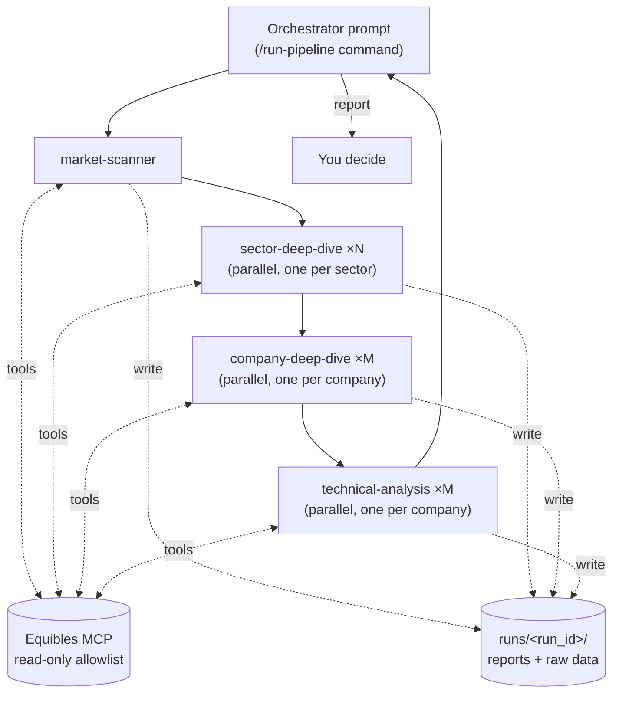

# Proposal: the pipeline as prompt-based subagents

**Status: proposal, not decided.** Nothing here changes the existing Python pipeline,
which stays in place and keeps working. This document describes an alternative build
in which each stage is a prompt-defined subagent that fetches its own data, lists what
it would cost against the principles in [ARCHITECTURE.md](ARCHITECTURE.md), and names
the decisions needed before any of it is built.

## 1. Why consider it

- **Much less code.** Stage behaviour lives in markdown prompts instead of ~5,800 lines
  of Python (agents, middleware, adapters, parsers).
- **Faster iteration.** Changing a stage means editing its prompt.
- **Agents can dig.** Today the middleware decides up front what each agent sees. A
  company agent that finds a doubtful catalyst could pull the 8-K, transcript, guidance
  or analyst estimates itself, instead of reporting a data gap.
- **Smaller outputs per call.** Each agent writes its own file, e.g. one file per
  company, instead of one large JSON reply. This avoids the failure seen in the first live run
  (2026-09-25): the Utilities sector deep dive's 25-company JSON was cut off at
  `max_tokens`.

## 2. Shape



**Runtime.** Claude Code in headless mode (`claude -p "/run-pipeline ..."`), with the
agents defined as files in the repo:

| File | Role |
|---|---|
| `.claude/commands/run-pipeline.md` | Orchestrator: sets `run_id` and `as_of`, launches the stage subagents in order, fans out one subagent per sector/company, writes the final report. |
| `.claude/agents/market-scanner.md` | Agent 0 |
| `.claude/agents/sector-deep-dive.md` | Agent 1 (one per sector) |
| `.claude/agents/company-deep-dive.md` | Company deep dive (one per company) |
| `.claude/agents/technical-analysis.md` | Technical analysis (one per company), reads the profile |
| `.claude/agents/follow-up.md`, `.claude/commands/follow-up.md` | Agent 5, one tick per invocation (cron) |
| `.claude/agents/process-review.md`, `.claude/commands/review.md` | Process review of a closed position |
| `.claude/settings.json` | MCP server config, tool allowlist and deny list (§4) |

Each subagent file has frontmatter (`name`, `description`, `tools`, `model`) and a
system prompt that carries today's stage prompt, the output contract and the data
rules. A subagent starts with a fresh context, so agents within a stage stay
independent (principle 1): each company agent sees only its own brief.

**Handoff by files, not conversation.** Every stage writes to `runs/<run_id>/`:

```
runs/<run_id>/
  run.json                     as_of, profile snapshot, stage list
  00-market/report.json        MarketScanOutput-shaped JSON
  00-market/raw/*.json         every tool result the agent used, verbatim
  01-sector/<sector>/report.json
  01-sector/<sector>/raw/*.json
  02-company/<ticker>/report.json
  02-company/<ticker>/raw/*.json
  03-technical/<ticker>/report.json
  report.md                    what you read
```

The orchestrator passes each subagent the *paths* of its upstream report and raw data,
so raw data still travels with the report (principle 2) and the scoping stays the same
(market + sector + the company's own data). The JSON shapes stay the Pydantic
schemas in `src/trading_pipeline/schemas.py`, restated in each prompt, so structured
reasoning (`StageReasoning`: factors, risks, data gaps, confidence) is kept (principle 4).

## 3. What changes against the current principles and hard rules

The hard rules in `CLAUDE.md` were written for the code design. Four of them can
only be kept by prompt instruction here, or must be reworded. **Each is a decision for
you** (§6).

| Rule / principle | Today (code) | Prompt-subagent version | Gap |
|---|---|---|---|
| **No look-ahead (`as_of`)** | Every provider takes `as_of`; `RawDataBundle.add` rejects later snapshots; statements count from the day after filing; macro values after a publication lag. | Agents call Equibles tools directly. Most return current data. | **Live runs are safe:** `as_of` = now, so nothing later exists. **Backtests are not point-in-time** and are unsupported in this design. The filing-day and publication-lag rules become prompt instructions, which can be broken. |
| **MCP only via `HttpMcpClient` + allowlist** | Allowlist built in code from adapters' `TOOLS`. | Allowlist in each subagent's `tools:` frontmatter plus a `permissions.deny` list in `.claude/settings.json`. | Enforced by the harness, not our code. `CLAUDE.md` wording must change. The Equibles server exposes **write tools** (`CreateMyPortfolio`, `AddPortfolioLot`, `UpdatePortfolioLot`, `ClosePortfolioLot`, `RemovePortfolioLot`, `DeleteMyPortfolio`, `WatchInstrument`, `UnwatchInstrument`, `ReportProblem`, `SuggestToolImprovement`): all of them go on the deny list. |
| **Your decisions never reach an agent** | Separate table; `Store.review_trail()` excludes it. | Decisions kept in a file outside the repo and outside `runs/` (e.g. `~/.trading-platform/decisions.json`), written only by a small command. Stage subagents get no `Read`/`Bash`/`Glob`/`Grep` over that path (`permissions.deny`). | Enforced by the harness deny rules; the orchestrator prompt must never load that file. Weaker than code. |
| **Deterministic rules** (price order, max loss, reward:risk, stale entry, earnings) | `rules.py`, pure functions, logged per stage. | A "rules check" instruction in the orchestrator. | A model can argue past a rule or miscalculate. See decision D3. |
| **Outcomes agent has no judgment** | Plain code, no LLM. | A subagent computing return/drawdown/hits from price tool output. | Arithmetic by an LLM. See decision D3. |
| **Gaps are explicit** | `Unavailable*` providers, `is_gap=True`. | Prompt rule: a failed or empty tool call is written to `data_gaps` and to `raw/` as `UNAVAILABLE`. | Relies on the agent. |
| **Improvement notes only after approval** | `ImprovementNote.approved`. | Notes in `notes/pending/`; approving moves a note to `notes/approved/`, which the stage prompts include. | Same guarantee if prompts read only `approved/`. |
| **Equibles call budget** | Fixed calls per stage (~100 for `check`, ~28 per company for fundamentals). | Agents decide how much to fetch. | Unbounded. A per-agent budget goes in each prompt, but nothing enforces it. |
| **Repeatability** | Same data per stage for the same `as_of`. | Each run fetches differently. | The process review compares runs that saw different data; `raw/` records what each saw. |

Unchanged: decision support only (no order tools on the allowlist), Equibles as the
only vendor, swing/long-term only, independent agents within a stage, the split
between outcomes and process review.

## 4. Tool access per agent

Tool names are `mcp__equibles__<Tool>`. Each subagent gets only what its stage needs:

| Agent | Equibles tools | Other tools |
|---|---|---|
| market-scanner | `GetStockPrices`, `GetLatestClosingPrices`, `GetEconomicIndicator`, `GetLatestEconomicIndicators`, `GetEconomicCalendar`, `GetVixHistory`, `GetPutCallRatios` | `Write` (its run folder) |
| sector-deep-dive | `GetEtfHoldings`, `GetStockPrices`, `ScreenStocks`, `GetValuationMultiples`, `ListFilings`, `GetFdaAdvisoryCommitteeMeetings`, `GetUpcomingInvestorEvents` | `Read` (its inputs), `Write` |
| company-deep-dive | `GetFinancialFact`, `GetFinancialStatement`, `ListFilings`, `SearchDocument`, `ReadDocumentLines`, `GetInvestorRelationsNews`, `GetGuidance`, `GetAnalystEstimates`, `GetEarningsCallTranscript`, `GetUpcomingInvestorEvents` | `Read`, `Write` |
| technical-analysis | `GetStockPrices`, `GetLiveQuote`, `GetLatestClosingPrices`, `GetAverageTrueRange`, `GetBollingerBands`, `GetStochasticOscillator`, `GetOnBalanceVolume`, `GetUpcomingInvestorEvents` | `Read`, `Write` |
| follow-up | `GetLiveQuote`, `GetStockPrices`, `ListFilings`, `GetInvestorRelationsNews` | `Read`, `Write` |
| process-review | none (reads the run trail only) | `Read` (run folder + outcome), `Write` |

Today, `technicals.py` computes indicators and pivots locally. Here the agent would use
the Equibles indicator tools and read levels from the bars itself.

## 5. Running it

- **Needs:** the Claude Code CLI on the machine that runs it, `ANTHROPIC_API_KEY`,
  and the Equibles MCP server configured with `EQUIBLES_API_KEY`.
- **Daily run:** `claude -p "/run-pipeline --max-sectors 1 --shortlist 3"` after the close.
- **Follow-up:** cron calls `claude -p "/follow-up"`; the 12h alert cooldown is kept in
  `positions/<id>/alerts.json` and applied by the prompt.
- **Decisions:** `/decide CANDIDATE accept|reject`, which writes only to the decisions
  file outside the repo (§3).

## 6. Decisions needed before building

- **D1. Backtests.** This design runs live only. Options: (a) keep the existing Python
  pipeline for backtests and replay, and use subagents live; (b) drop backtesting;
  (c) add a thin local MCP server that wraps the existing providers so tools
  enforce `as_of` (this is code, so the design is no longer pure prompts).
- **D2. `CLAUDE.md` hard rules.** Reword the `HttpMcpClient` rule (harness allowlist
  instead) and the `as_of` rule (live runs only, or per D1).
- **D3. Rules and outcomes.** Keep `rules.py` and `agents/outcomes.py` as small scripts
  the orchestrator runs (recommended: they are arithmetic, and a model can talk itself
  past a limit), or move them into prompts.
- **D4. Coexistence.** Keep both pipelines side by side and compare them on the same
  days before retiring anything (recommended), or replace the Python stages.
- **D5. Budgets.** Per-agent Equibles call budget and model per stage (e.g. a smaller
  model for sector screening, the largest for company deep dives).

## 7. Suggested order

1. Market scanner + sector deep dive as subagents; run live next to the Python
   pipeline on the same day and compare sector calls and shortlists.
2. Company deep dive + technical analysis (+ rules per D3); compare recommendations.
3. Follow-up, outcomes, process review, improvement notes.
4. Decide D4 from the comparison.
