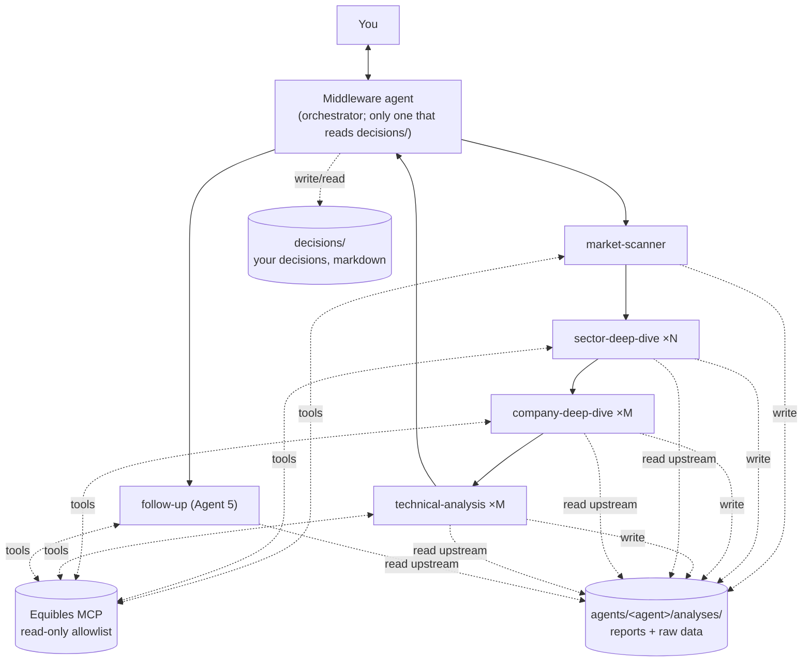

# Proposal: the pipeline as prompt-based subagents

**Status: proposal, not decided.** Nothing here changes the existing Python pipeline,
which stays in place and keeps working. This document describes an alternative build
in which each stage is a prompt-defined subagent that fetches its own data. It also
lists what that costs against the principles in [ARCHITECTURE.md](ARCHITECTURE.md)
and names the decisions needed before any of it is built.

Direction from the user (2026-09-25):

1. The orchestrator records the user's decisions in markdown files.
2. Each agent keeps a folder of its analysis runs. The folder is the agent's feedback
   record and the way raw data passes from one agent to the next.
3. Each agent has four prompts: **default** (end-to-end run), **isolation** (run on its
   own), **evaluation** (grade its past decisions, alongside the user's trade) and
   **feedback** (improve the agent from its analysis folder).
4. Agent 5 (follow-up) can read all of that data when it needs to.
5. A **middleware agent** is the orchestrator and the only interface between the
   agents and the user.

## 1. Why consider it

- **Much less code.** Stage behaviour lives in markdown prompts instead of ~5,800 lines
  of Python (agents, middleware, adapters, parsers).
- **Faster iteration.** Changing a stage means editing its prompt.
- **Agents can dig.** Today the middleware decides up front what each agent sees. A
  company agent that finds a doubtful catalyst could pull the 8-K, transcript, guidance
  or analyst estimates itself, instead of reporting a data gap.
- **Smaller outputs per call.** One analysis file per subject, instead of one large JSON
  reply per stage. This avoids the failure of the first live run (2026-09-25): the
  Utilities sector deep dive's 25-company JSON was cut off at `max_tokens`.

## 2. Shape



**Runtime.** Claude Code. The middleware agent is the main session, driven by slash
commands (interactive, or headless with `claude -p "/run ..."` for cron). It launches
each stage agent as a subagent. A subagent starts with a fresh context, so agents
within a stage stay independent (principle 1): each company agent sees only its own
brief.

**Stages hand off through the analysis folders, not the conversation.** The middleware
agent passes each agent the *paths* of its upstream analyses. Raw data still travels
with the report (principle 2), scoped as today: market + sector + the company's own data.

## 3. Repository layout (prompts, versioned)

```
prompts/
  <agent>/                       one folder per agent (list in §6)
    role.md                      shared by all modes: role, data rules, output format
    default.md                   end-to-end run: inputs come from upstream analyses
    isolation.md                 on its own: you give the subject, the agent fetches
                                 the context an upstream agent would have supplied
    evaluation.md                grade past analyses against what happened (§5)
    feedback.md                  read analyses + evaluations, propose improvements (§5)
    lessons.md                   approved improvements; role.md always includes it
  middleware/
    role.md                      orchestration rules, the decisions firewall (§7)
    report.md                    how the report to you is written

.claude/agents/                  subagent definitions (frontmatter: name, description,
  <agent>.md                       tools, model); default + isolation modes
  <agent>-evaluator.md           evaluation mode (different tools)
  <agent>-feedback.md            feedback mode (no market-data tools)

.claude/commands/                your entry points into the middleware agent
  run.md                         /run [--max-sectors N] [--shortlist N]
  run-agent.md                   /run-agent <agent> <subject>   (isolation)
  decide.md                      /decide <candidate_id> accept|reject [note]
  trade.md                       /trade <position_id> entered|exited <price> [date]
  follow-up.md                   /follow-up                      (cron)
  evaluate.md                    /evaluate [<agent>] [--since DATE]
  feedback.md                    /feedback <agent>
  approve.md                     /approve <agent> <proposal_id>
.claude/settings.json            Equibles MCP server, tool deny list (§7)
```

Modes are separate subagent files because they need different tools: evaluation needs
price data, feedback needs none. Each file's body tells the subagent to read
`prompts/<agent>/role.md` and the mode's prompt.

**Approval is a commit.** An approved feedback proposal is added to that agent's
`prompts/<agent>/lessons.md`. It is versioned in git, so every analysis can record the
prompt version (commit) it ran with, and a bad lesson can be reverted.

## 4. Workspace layout (data, outside git)

Analyses contain Equibles data and grow every day, so they live outside the repo:
`~/.trading-platform/workspace/` (or `TRADING_WORKSPACE`).

```
workspace/
  runs/<run_id>/run.md                    manifest: as_of, mode, agents run, prompt
                                          commit, links to each analysis
  agents/<agent>/
    analyses/<run_id>/<subject>/          subject = "market", a sector or a ticker
      analysis.md                         the agent's output (format below)
      raw/<tool>-<n>.json                 every tool result it used, verbatim
    evaluations/<eval_id>.md              evaluation-mode output
    feedback/<proposal_id>.md             feedback proposals, status: pending|approved|rejected
  positions/<position_id>/
    position.md                           the plan being watched (from the technical analysis)
    alerts.md                             tripwire log, 12h cooldown state
    reviews/<date>.md                     Agent 5 re-reviews
  decisions/                              YOUR records; only the middleware agent reads this
    <candidate_id>.md
```

**Analysis file** (every agent, every mode): YAML frontmatter for the fields later
steps compare, and markdown sections for the reasoning (today's `StageReasoning`).

```markdown
---
agent: company-deep-dive
mode: default                 # default | isolation
run_id: 620b277e
as_of: 2026-09-25T20:00:00Z
prompt_commit: 1a2b3c4
subject: XOM
upstream: [sector-deep-dive/620b277e/Energy]
verdict: worthy               # agent-specific: direction, potential_score, entry/stop/target...
confidence: 0.64
---
## Summary
## Factors for
## Factors against
## Evidence            (each point cites a file in raw/)
## Risks considered
## Data gaps
```

**Decision file** (written by `/decide` and `/trade`; the structure is a proposal):

```markdown
---
candidate_id: 620b277e-XOM
run_id: 620b277e
ticker: XOM
decision: accept              # accept | reject
decided_at: 2026-09-26T14:05:00-04:00
position_id: p-0007           # accept only
---
## Why
Your reasoning, free text.

## Trade log
| date | action | price | size |
|---|---|---|---|
| 2026-09-26 | entered | 118.40 | 50 |
| 2026-10-30 | exited  | 131.10 | 50 |

## Afterwards
What you'd do differently (optional).
```

## 5. The four prompts per agent

| Mode | When | Reads | Writes |
|---|---|---|---|
| **Default** | `/run`, launched by the middleware agent | upstream analyses + their `raw/`, Equibles | `analyses/<run_id>/<subject>/` |
| **Isolation** | `/run-agent <agent> <subject>` | Equibles only; it fetches the context an upstream agent would have given | `analyses/<run_id>/<subject>/`, `mode: isolation` |
| **Evaluation** | `/evaluate`, once outcomes are known | its past analyses, prices since then (Equibles), position outcomes | `evaluations/` |
| **Feedback** | `/feedback <agent>` | its analyses + evaluations | `feedback/<proposal_id>.md` (pending) |

**Evaluation** grades each agent on what it can be judged on:

| Agent | Graded on |
|---|---|
| market-scanner | Did the sectors it called up/down move that way relative to SPY over the horizon? |
| sector-deep-dive | Did higher `potential_score` companies do better, **including the ones not forwarded**? |
| company-deep-dive | Did the catalysts it checked materialise? Were risks that later hit listed? |
| technical-analysis | Stop or target first (per `level_trigger`), reward:risk realised, entries never filled. |
| follow-up | Were alerts material and timely? Did exit/adjust calls help? |

Because prices of rejected and not-forwarded candidates are graded too, the evaluation
works without any trade being made (a "shadow ledger"). This is the Phase 0 idea in
[`testing-research.md`](testing-research.md).

**Feedback** looks across many evaluations for repeated patterns (e.g. "misses
rate-sensitivity in utilities", "stops inside the ATR"). It writes proposals with the
evidence (links to analyses and evaluations). You approve them with `/approve`, which
adds them to `lessons.md`. Nothing changes a prompt without your approval, as today.

## 6. Agents and their tools

Tool names are `mcp__equibles__<Tool>`. "Analyses" means `Read` on the workspace paths
listed in the mode table above.

| Agent | Equibles tools (default / isolation) |
|---|---|
| market-scanner | `GetStockPrices`, `GetLatestClosingPrices`, `GetEconomicIndicator`, `GetLatestEconomicIndicators`, `GetEconomicCalendar`, `GetVixHistory`, `GetPutCallRatios` |
| sector-deep-dive | `GetEtfHoldings`, `GetStockPrices`, `ScreenStocks`, `GetValuationMultiples`, `ListFilings`, `GetFdaAdvisoryCommitteeMeetings`, `GetUpcomingInvestorEvents` |
| company-deep-dive | `GetFinancialFact`, `GetFinancialStatement`, `ListFilings`, `SearchDocument`, `ReadDocumentLines`, `GetInvestorRelationsNews`, `GetGuidance`, `GetAnalystEstimates`, `GetEarningsCallTranscript`, `GetUpcomingInvestorEvents` |
| technical-analysis | `GetStockPrices`, `GetLiveQuote`, `GetLatestClosingPrices`, `GetAverageTrueRange`, `GetBollingerBands`, `GetStochasticOscillator`, `GetOnBalanceVolume`, `GetUpcomingInvestorEvents` |
| follow-up (Agent 5) | `GetLiveQuote`, `GetStockPrices`, `ListFilings`, `GetInvestorRelationsNews`, plus `Read` on **all** of `agents/` and `positions/`, not on `decisions/` (§7) |
| middleware | none directly; launches the agents, reads/writes `runs/` and `decisions/` |

Evaluator subagents get only `GetStockPrices` / `GetLatestClosingPrices`. Feedback
subagents get no Equibles tools. Today `technicals.py` computes indicators and pivots
locally; here the agent uses the Equibles indicator tools and reads levels from the bars.

## 7. Against the current principles and hard rules

**Your decisions vs "evaluate next to the user trade" (needs your call, D0).** The hard
rule in `CLAUDE.md` and principle 5 say your accept/reject never reaches the
process review or any stage prompt, so the system doesn't learn your biases as its own
judgment. Point 3 above asks the evaluation to look at your trade. Proposal that keeps
both:

- The middleware agent is the only reader of `decisions/`.
- **Trade facts** (entry/exit price and date of an accepted position) are copied into
  `positions/<id>/position.md`, because outcomes need them. This is what the code does
  today with `close --price`.
- Evaluation writes two separate things:
  1. **Agent vs market**, in `agents/<agent>/evaluations/`. This is what feedback
     reads.
  2. **Agent vs your trade** (your decision, your reasoning, where you and the agent
     differed), written by the middleware agent to `decisions/reviews/`. It is shown
     to you only. No feedback prompt reads it, so it never becomes a lesson.
- The alternative, letting feedback learn from your decisions, means rewording the
  hard rule. The risk: the agents drift toward what you tend to accept rather than
  what works.

**Agent 5 reads everything except `decisions/`.** It gets `Read` on `agents/` and
`positions/`. Your reasoning and notes stay out.

| Rule / principle | Today (code) | This design | Gap |
|---|---|---|---|
| **No look-ahead (`as_of`)** | Every provider takes `as_of`; later snapshots are rejected; statements count from the day after filing; macro after a publication lag. | Agents call Equibles directly; most tools return current data. | **Live runs are safe**: `as_of` = now. **Backtests are not point-in-time.** Isolation runs on a past date aren't either. The filing-day and publication-lag rules become prompt instructions. See D1. |
| **MCP only via `HttpMcpClient` + allowlist** | Allowlist built from adapters' `TOOLS`. | Per-subagent `tools:` lists plus `permissions.deny` in `.claude/settings.json`. | Enforced by Claude Code, not our code; `CLAUDE.md` wording must change (D2). The Equibles server has **write tools**: `CreateMyPortfolio`, `AddPortfolioLot`, `UpdatePortfolioLot`, `ClosePortfolioLot`, `RemovePortfolioLot`, `DeleteMyPortfolio`, `WatchInstrument`, `UnwatchInstrument`, `ReportProblem`, `SuggestToolImprovement`. All go on the deny list. |
| **Decisions firewall** | Separate table; `Store.review_trail()` excludes it. | `decisions/` read by the middleware agent only; `permissions.deny` on that path for every subagent. | The middleware agent reads both decisions and agent briefs, so its prompt must never copy one into the other. Weaker than code. |
| **Deterministic rules** | `rules.py` | Prompt instruction to the middleware agent, or a script it runs. | See D3. |
| **Outcomes without judgment** | Plain code | Evaluator arithmetic, or a script. | See D3. |
| **Gaps are explicit** | `Unavailable*` providers | Prompt rule: failed or empty tool calls go under "Data gaps" and in `raw/` as `UNAVAILABLE`. | Relies on the agent. |
| **Lessons only after approval** | `ImprovementNote.approved` | `/approve` → `lessons.md` (a commit). | Same guarantee. |
| **Equibles call budget** | Fixed calls per stage | Agents choose. | Unbounded; a budget in each prompt, not enforced (D5). |
| **Repeatability** | Same data per stage for one `as_of` | Each run fetches differently. | `raw/` records what each agent saw, so evaluation can tell "bad reasoning" from "didn't look". |

Unchanged: decision support only (no order tools anywhere), Equibles as the only
vendor, swing/long-term only, agents independent within a stage, outcomes separate
from reasoning review.

## 8. Decisions needed before building

- **D0. Your trade in evaluation:** the two-output split in §7 (recommended), or let
  feedback learn from your decisions (rewords a hard rule).
- **D1. Backtests:** (a) keep the Python pipeline for backtests and use subagents live;
  (b) drop backtesting; (c) a thin local MCP server wrapping the existing providers so
  tools enforce `as_of` (that is code).
- **D2. `CLAUDE.md` hard rules:** reword the `HttpMcpClient` rule and the `as_of` rule.
- **D3. Rules and outcomes:** keep `rules.py` and the outcome arithmetic as small
  scripts the middleware agent runs (recommended), or move them into prompts.
- **D4. Coexistence:** run both pipelines on the same days and compare before retiring
  anything (recommended), or replace the Python stages.
- **D5. Budgets and models:** an Equibles call budget per agent, and a model per agent
  and mode.

## 9. Suggested order

1. Workspace + decision formats, `prompts/middleware/`, `/run` and `/decide`.
2. market-scanner and sector-deep-dive (default + isolation); run live next to the
   Python pipeline on the same day and compare.
3. company-deep-dive and technical-analysis, rules per D3.
4. Agent 5, `/trade`, positions.
5. Evaluation and feedback prompts for every agent; `/evaluate`, `/feedback`,
   `/approve`.
6. Decide D4 from the comparison.
