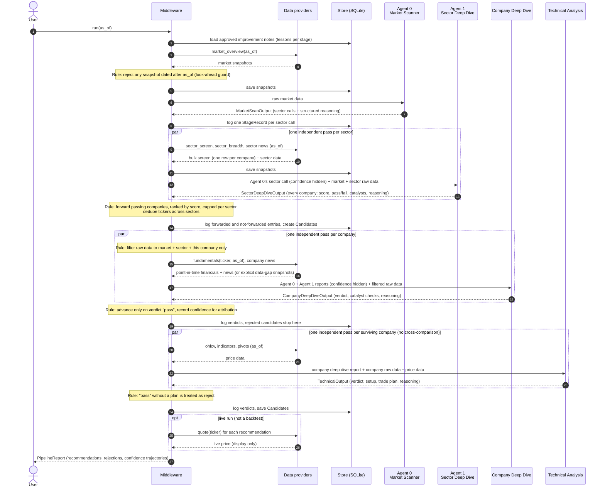
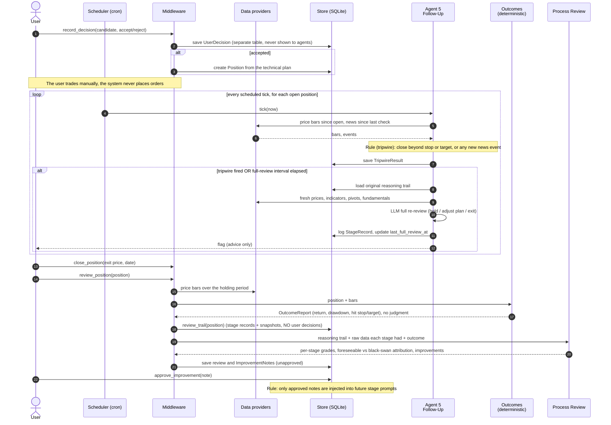

# Sequence diagrams

How data moves between agents at runtime. Agents never call each other: the
**Middleware** fetches data, builds each prompt from the upstream report plus the
relevant raw data, validates the structured reply, logs it, and hands it on. See
[ARCHITECTURE.md](ARCHITECTURE.md) for the principles behind each step.

Notes marked **Rule** are deterministic checks in code (no LLM).

## 1. Pipeline run (one `as_of` date)

Rendered: [diagrams/sequence-pipeline-run.png](diagrams/sequence-pipeline-run.png)

## 2. User decision, follow-up loop, and review

Rendered: [diagrams/sequence-followup-review.png](diagrams/sequence-followup-review.png)

